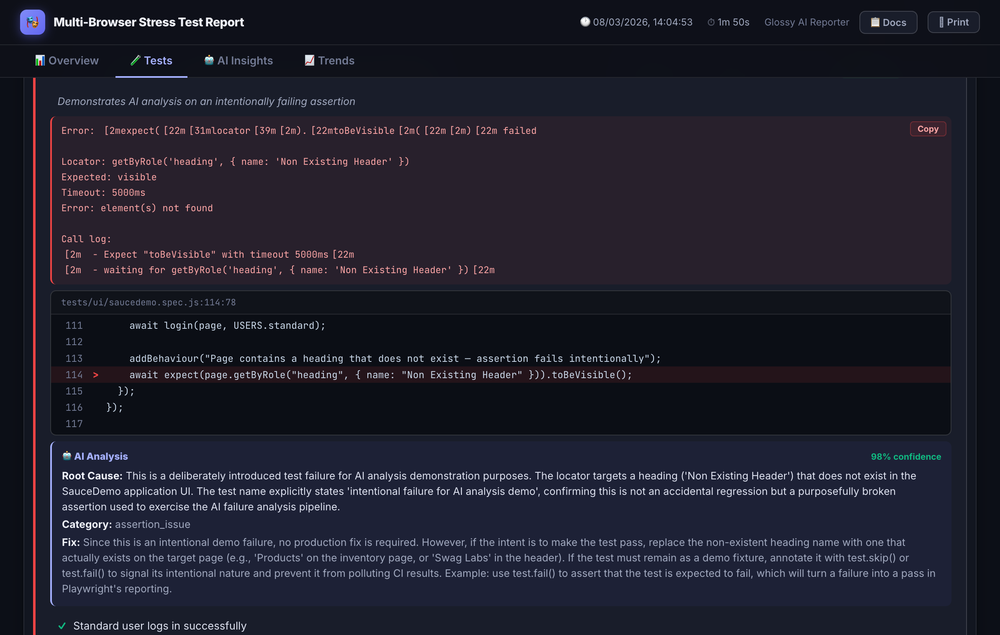

# playwright-spec-doc-reporter

A beautiful, production-ready Playwright reporter with BDD-style annotations, inline API request/response display, AI-powered failure analysis, test history trends, and self-healing payload exports.

[](https://www.npmjs.com/package/playwright-spec-doc-reporter)
[](https://github.com/pnakhat/playwright-spec-doc-reporter/actions/workflows/ci.yml)
[](LICENSE)

---

## Screenshots

### Dashboard Overview


### Tests & BDD View (with browser badges)


### Inline API Request / Response Viewer


### Failure Detail with AI Analysis


### AI Insights Tab


### Run History & Trends


---

## Features

- **Interactive HTML dashboard** — dark-themed report with filter, search, sort, and failure drill-down
- **BDD annotations** — add Feature, Scenario, and Behaviour metadata directly in your tests
- **Browser badges** — chromium, firefox, and webkit runs shown with distinct colour-coded pills
- **Inline API viewer** — attach request/response JSON directly to test results with syntax highlighting
- **AI failure analysis** — automatic root-cause analysis for failed tests (OpenAI, Anthropic, or custom)
- **Healing payloads** — structured JSON + Markdown export of suggested locator fixes
- **PR Comment Mode** — emit a compact markdown summary for posting directly as a GitHub/Azure DevOps PR comment
- **Docs page** — generate filtered Markdown/HTML behaviour specs from your test suite
- **History & trends** — pass-rate and duration charts across runs via `spec-doc-history.json`
- **Zero runtime dependencies** — single self-contained HTML file output

---

## Install

```bash
npm install -D playwright-spec-doc-reporter
```

`@playwright/test >= 1.44.0` is a peer dependency.

---

## Quick start

Because this package is ESM-only, create a thin `reporter.mjs` shim in your project root:

```js
// reporter.mjs
export { GlossyPlaywrightReporter as default } from "playwright-spec-doc-reporter";
```

Then reference it in `playwright.config.ts` / `playwright.config.js`:

```ts
import { defineConfig } from "@playwright/test";

export default defineConfig({
  reporter: [
    ["list"],
    [
      "./reporter.mjs",
      {
        outputDir: "spec-doc-report",
        reportTitle: "E2E Quality Report",
        includeScreenshots: true,
        includeVideos: true,
        includeTraces: true,
      },
    ],
  ],
});
```

Run your tests as normal:

```bash
npx playwright test
```

After each run, `spec-doc-report/` contains:

| File | Description |
|------|-------------|
| `index.html` | Self-contained interactive HTML report |
| `results.json` | Full normalized JSON for CI/CD processing |
| `spec-doc-history.json` | Per-run history for trend charts |
| `healing.json` | AI-suggested locator fixes (when AI enabled) |
| `healing.md` | Human-readable healing summary (when AI enabled) |
| `pr-comment.md` | Compact markdown for PR comments (when `prComment` enabled) |

---

## BDD Annotations

Import annotation helpers from the `/annotations` sub-path and call them inside `test()` bodies.

```ts
import { addFeature, addScenario, addBehaviour } from "playwright-spec-doc-reporter/annotations";
```

### `addFeature(name, description?)`

Sets the Feature name and optional Gherkin-style narrative. Call once per `describe` block via `beforeEach`.

```ts
test.describe("Shopping Cart", () => {
  test.beforeEach(() => {
    addFeature(
      "Shopping Cart",
      "As a customer I want to add products to my cart so I can purchase them"
    );
  });

  test("add item to cart", async ({ page }) => { /* ... */ });
});
```

### `addScenario(description)`

Sets a scenario-level description (acceptance criteria) for the current test.

```ts
test("standard user can login and add item to cart", async ({ page }) => {
  addScenario("Verifies the happy-path for a standard user adding one item");
  // ...
});
```

### `addBehaviour(description)`

Adds a human-readable behaviour step. These appear in the BDD view and exported Docs instead of raw Playwright step names.

```ts
test("login flow", async ({ page }) => {
  addBehaviour("User submits valid credentials on the login page");
  await page.goto("/login");
  await page.fill("#email", "user@example.com");
  await page.click("button[type=submit]");

  addBehaviour("User is redirected to the dashboard");
  await expect(page).toHaveURL("/dashboard");
});
```

---

## Inline API Request / Response

Attach request and response data so they appear inline in the report with syntax-highlighted JSON.

```ts
import {
  addFeature, addScenario, addBehaviour,
  addApiRequest, addApiResponse
} from "playwright-spec-doc-reporter/annotations";

test.describe("Posts API", () => {
  test.beforeEach(() => {
    addFeature("Posts API", "As a developer I want to validate the posts endpoints");
  });

  test("POST /posts creates a resource", async ({ request, baseURL }) => {
    addScenario("Verifies a new post is created and returned with an id");

    const payload = { title: "Hello", body: "World", userId: 1 };

    addBehaviour("Client sends POST request with post data");
    addApiRequest("POST", `${baseURL}/posts`, payload);
    const res = await request.post(`${baseURL}/posts`, { data: payload });
    const body = await res.json();
    addApiResponse(res.status(), body);

    addBehaviour("Response is 201 with the new resource including an id");
    expect(res.status()).toBe(201);
    expect(body).toMatchObject(payload);
  });
});
```

The report shows each pair with a colour-coded method badge, URL, collapsible JSON body, and HTTP status badge.

### `addApiRequest(method, url, body?, headers?)`

| Param | Type | Description |
|-------|------|-------------|
| `method` | `string` | HTTP method (`GET`, `POST`, etc.) |
| `url` | `string` | Full request URL |
| `body` | `unknown` | Request body (JSON-serialized in the report) |
| `headers` | `Record<string, string>` | Request headers (shown collapsed) |

### `addApiResponse(status, body?, headers?)`

| Param | Type | Description |
|-------|------|-------------|
| `status` | `number` | HTTP status code |
| `body` | `unknown` | Response body (JSON-serialized in the report) |
| `headers` | `Record<string, string>` | Response headers (shown collapsed) |

---

## Reporter configuration

```ts
type SpecDocReporterConfig = {
  /** Output directory. Default: "spec-doc-report" */
  outputDir?: string;

  /** Report title shown in the dashboard header. */
  reportTitle?: string;

  /** Include screenshots in the report. Default: true */
  includeScreenshots?: boolean;

  /** Include video recordings. Default: true */
  includeVideos?: boolean;

  /** Include Playwright traces. Default: true */
  includeTraces?: boolean;

  /** AI failure analysis configuration. */
  ai?: {
    enabled: boolean;
    provider: "openai" | "anthropic" | "custom";
    model: string;
    apiKey?: string;
    baseURL?: string;
    maxTokens?: number;
    rateLimitPerMinute?: number;
    maxFailuresToAnalyze?: number;
    customPrompt?: string;
  };

  /** Healing payload export configuration. */
  healing?: {
    enabled: boolean;
    exportPath?: string;
    exportMarkdownPath?: string;
    analysisOnly?: boolean;
  };

  /** PR comment markdown generation. */
  prComment?: {
    enabled: boolean;
    outputPath?: string;       // default: <outputDir>/pr-comment.md
    artifactUrl?: string;      // falls back to REPORT_ARTIFACT_URL env var
    title?: string;            // branch/label shown in the header
    maxFailures?: number;      // max failed tests to list inline, default 10
  };

  /** Factory for a custom AI provider. */
  providerFactory?: (config: AIProviderConfig) => AIProvider;
};
```

---

## AI failure analysis

When a test fails, the reporter automatically calls your configured AI provider to analyse the error, stack trace, and screenshot. Results appear inline next to each failing test and summarised on the **AI Insights** tab.

### OpenAI

```ts
ai: {
  enabled: true,
  provider: "openai",
  model: "gpt-4.1",              // or "gpt-4o", "gpt-4o-mini"
  apiKey: process.env.OPENAI_API_KEY,
  maxFailuresToAnalyze: 10,
  maxTokens: 1200,
  rateLimitPerMinute: 20,
}
```

### Anthropic

```ts
ai: {
  enabled: true,
  provider: "anthropic",
  model: "claude-sonnet-4-6",    // or "claude-opus-4-6", "claude-haiku-4-5"
  apiKey: process.env.ANTHROPIC_API_KEY,
  maxFailuresToAnalyze: 10,
}
```

### Custom prompt

```ts
ai: {
  enabled: true,
  provider: "anthropic",
  model: "claude-sonnet-4-6",
  apiKey: process.env.ANTHROPIC_API_KEY,
  customPrompt: `
    You are an expert in Playwright + React testing.
    Prioritise data-testid selectors over CSS classes.
    Always provide a ready-to-paste code patch when the issue is a locator.
  `,
}
```

### Custom provider

```ts
import type { AIProvider, AIProviderConfig } from "playwright-spec-doc-reporter";

const providerFactory = (_cfg: AIProviderConfig): AIProvider => ({
  name: "internal-llm",
  async analyzeFailure(input, cfg) {
    const response = await fetch("https://ai.internal/analyze", {
      method: "POST",
      headers: { Authorization: `Bearer ${cfg.apiKey}` },
      body: JSON.stringify({ error: input.errorMessage, stack: input.stackTrace }),
    });
    const data = await response.json();
    return {
      testName: input.testName,
      file: input.file,
      summary: data.summary,
      likelyRootCause: data.rootCause,
      confidence: data.confidence,
      suggestedRemediation: data.fix,
      issueCategory: data.category ?? "unknown",
      structuredFeedback: {
        actionType: data.actionType ?? "investigate",
        reasoning: data.reasoning,
        suggestedPatch: data.patch,
      },
    };
  },
});
```

Pass the factory to the reporter config:

```ts
// playwright.config.ts
import { providerFactory } from "./my-ai-provider.js";

reporter: [["./reporter.mjs", { ai: { enabled: true }, providerFactory }]]
```

### Store the API key safely

```bash
# .env (gitignored)
ANTHROPIC_API_KEY=sk-ant-...
OPENAI_API_KEY=sk-...
```

Load it without dotenv (Node 20.6+):

```bash
node --env-file=.env node_modules/.bin/playwright test
```

Or add to `package.json`:

```json
{ "scripts": { "test": "node --env-file=.env node_modules/.bin/playwright test" } }
```

The `apiKey` config field falls back to `process.env.ANTHROPIC_API_KEY` / `process.env.OPENAI_API_KEY` automatically.

---

## Healing payloads

When AI analysis identifies locator issues (`issueCategory: "locator_drift"`), structured healing payloads are generated alongside the report.

```ts
healing: {
  enabled: true,
  exportPath: "spec-doc-report/healing.json",
  exportMarkdownPath: "spec-doc-report/healing.md",
  analysisOnly: true,  // never auto-modifies test files
}
```

**Payload schema:**

```ts
interface HealingPayload {
  testName: string;
  file: string;
  stepName?: string;
  failedLocator?: string;
  candidateLocators: string[];  // ranked alternatives
  domContext?: string;          // surrounding HTML snippet
  errorMessage?: string;
  suggestedPatch?: string;      // ready-to-apply code change
  reasoning: string;
  confidence: number;           // 0–1
  actionType: string;
}
```

The `healing.md` export is human-readable and CI-comment-friendly.

---

## PR Comment Mode

Instead of downloading a report artifact, engineers reviewing a PR get test results inline — right where they're already looking.

Enable it in `playwright.config`:

```ts
prComment: {
  enabled: true,
  artifactUrl: process.env.REPORT_ARTIFACT_URL,  // link to the uploaded HTML report
  maxFailures: 10,
}
```

This writes `spec-doc-report/pr-comment.md` after each run:

```markdown
## 🎭 Test Report — `feat/payment-flow` · Run #142

| | Result |
|---|---|
| ✅ Passed | 84 |
| ❌ Failed | 3 |
| ⏭️ Skipped | 2 |
| 📊 Total | 89 |
| ⏱️ Duration | 4m 12s |

### ❌ Failed Tests
- ❌ `Checkout › Payment › should process card with 3DS` — *Element not found: [data-testid="confirm-btn"]*
- ❌ `Checkout › Payment › should show error on decline` — *Timeout 30000ms exceeded*
- ❌ `Auth › Login › should redirect after SSO` — *Expected URL to contain /dashboard*

> 🤖 **AI Analysis** (92% confidence): Failures suggest a recent DOM change in the payment confirmation step. [View full analysis →](https://your-artifact-url/report.html)

[📊 Full Report →](https://your-artifact-url/report.html)
```

### Posting the comment on GitHub

```yaml
- name: Upload report
  if: always()
  uses: actions/upload-artifact@v4
  with:
    name: test-report
    path: spec-doc-report/

- name: Post PR comment
  if: always() && github.event_name == 'pull_request'
  uses: marocchino/sticky-pull-request-comment@v2
  with:
    path: spec-doc-report/pr-comment.md
```

Set `REPORT_ARTIFACT_URL` to point reviewers at the full report:

```yaml
- name: Run tests
  run: npx playwright test
  env:
    REPORT_ARTIFACT_URL: https://github.com/${{ github.repository }}/actions/runs/${{ github.run_id }}
```

### Posting on Azure DevOps

```yaml
- task: PowerShell@2
  displayName: Post PR comment
  condition: always()
  inputs:
    targetType: inline
    script: |
      $comment = Get-Content spec-doc-report/pr-comment.md -Raw
      $body = @{ content = $comment; parentCommentId = 0; commentType = 1 } | ConvertTo-Json
      $url = "$env:SYSTEM_TEAMFOUNDATIONCOLLECTIONURI$env:SYSTEM_TEAMPROJECTID/_apis/git/repositories/$(Build.Repository.ID)/pullRequests/$(System.PullRequest.PullRequestId)/threads?api-version=7.1"
      Invoke-RestMethod -Uri $url -Method Post -Headers @{ Authorization = "Bearer $env:SYSTEM_ACCESSTOKEN" } -Body $body -ContentType "application/json"
  env:
    SYSTEM_ACCESSTOKEN: $(System.AccessToken)
```

### Branch and run detection

Branch name, commit SHA, and run number are automatically detected from CI environment variables (`GITHUB_REF_NAME`, `GITHUB_SHA`, `GITHUB_RUN_NUMBER`, and Azure DevOps equivalents). No manual configuration needed in most setups.

---

## History & trends

The reporter automatically maintains `spec-doc-history.json` and records each run's pass rate, duration, and per-test status. The **Trends** tab shows pass-rate charts and per-test stability indicators across runs.

---

## Docs page

The **Docs** tab generates a filtered behaviour specification from your annotated tests. Use the filter controls to select by status, browser/project, and feature — then export as Markdown or rendered HTML for sharing with stakeholders.

---

## Requirements

- Node.js >= 18
- `@playwright/test` >= 1.44.0 (peer dependency)

---

## License

[MIT](LICENSE)
