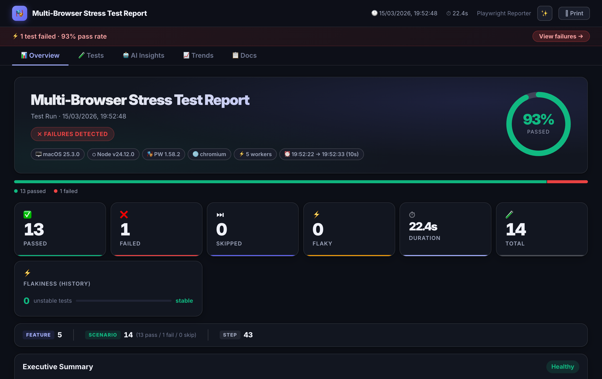
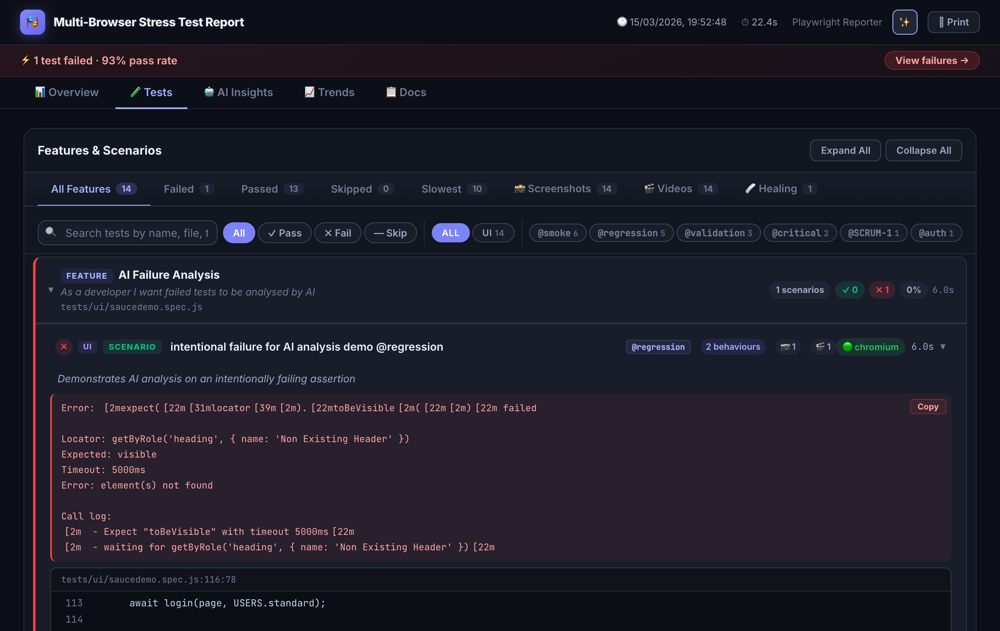
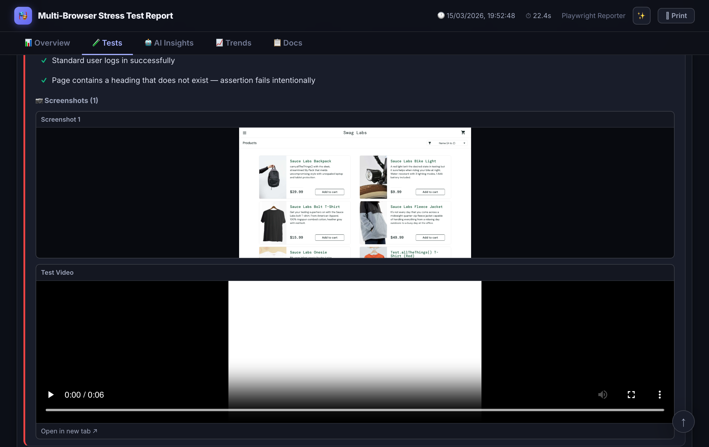
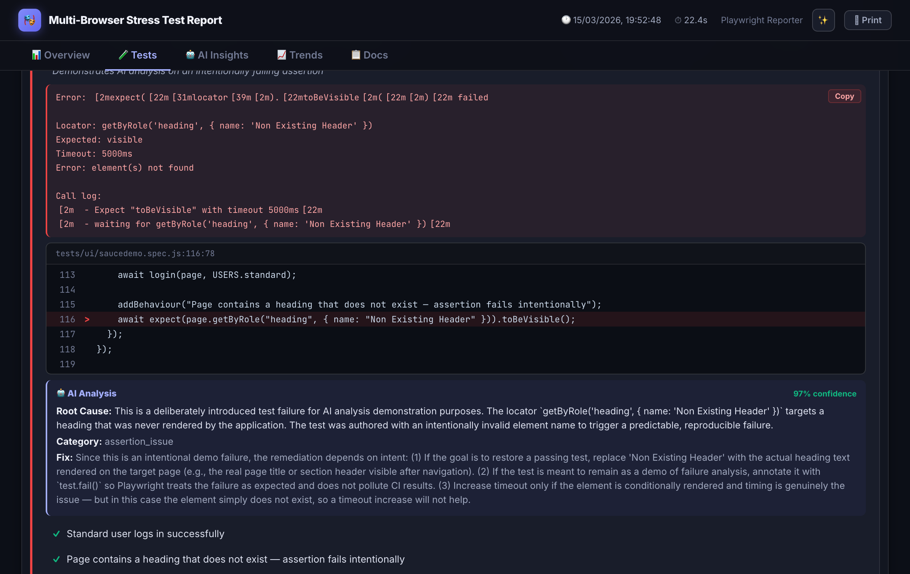
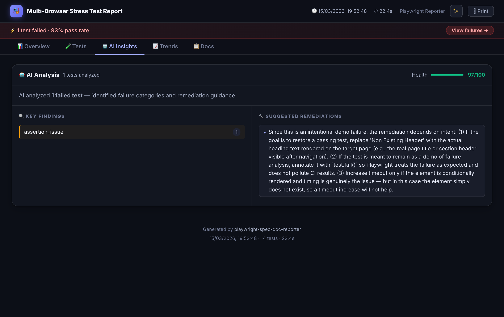
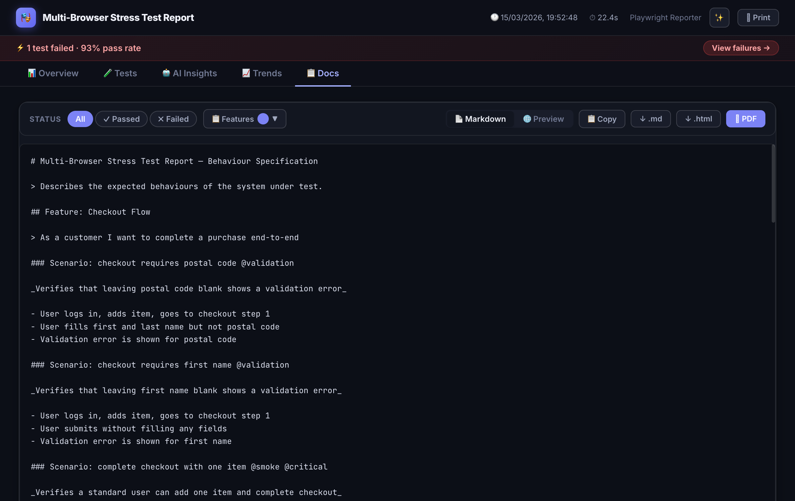
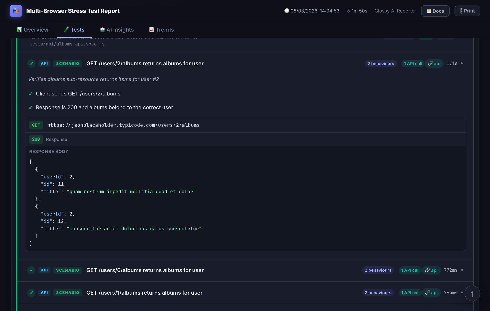

# playwright-spec-doc-reporter

A beautiful, production-ready Playwright reporter with BDD-style annotations, inline API request/response display, AI-powered failure analysis, test history trends, self-healing payload exports, and automatic Jira issue commenting with screenshot evidence.

[](https://www.npmjs.com/package/playwright-spec-doc-reporter)
[](https://github.com/pnakhat/playwright-spec-doc-reporter/actions/workflows/ci.yml)
[](LICENSE)

---

## Screenshots

### Dashboard Overview


### Tests Tab — Failure with AI Analysis Expanded


### Test Detail — BDD Annotations, AI Analysis, Screenshots & Video


### BDD Feature / Scenario / Behaviours View


### AI Insights Tab — Root Cause Analysis & Remediations


### Run History & Trends


### Docs Tab — Behaviour Specification Export


### Inline API Request / Response Viewer


---

## Features

- **Interactive HTML dashboard** — dark-themed report with filter, search, sort, and failure drill-down
- **BDD annotations** — add Feature, Scenario, and Behaviour metadata directly in your tests
- **Browser badges** — chromium, firefox, and webkit runs shown with distinct colour-coded pills
- **Inline API viewer** — attach request/response JSON directly to test results with syntax highlighting
- **AI failure analysis** — automatic root-cause analysis for failed tests (OpenAI, Anthropic, Azure, or custom)
- **Healing payloads** — structured JSON + Markdown export of suggested locator fixes
- **PR Comment Mode** — emit a compact markdown summary for posting directly as a GitHub/Azure DevOps PR comment
- **Docs page** — generate filtered Markdown/HTML/PDF behaviour specs from your test suite with live feature filtering
- **History & trends** — pass-rate and duration charts across runs via `spec-doc-history.json`
- **Jira integration** — automatically post test results as Jira comments; includes BDD docs, steps, screenshots, and API traffic; cooldown setting prevents comment spam
- **Flakiness scoring** — per-test stability badges computed from run history (0–100%)
- **Theme switcher** — dark-glossy, dark, and light themes with localStorage persistence
- **Zero runtime dependencies** — single self-contained HTML file output

---

## Install

```bash
npm install -D playwright-spec-doc-reporter
```

`@playwright/test >= 1.44.0` is a peer dependency.

---

## Quick start

Because this package is ESM-only, create a thin `reporter.mjs` shim in your project root:

```js
// reporter.mjs
export { GlossyPlaywrightReporter as default } from "playwright-spec-doc-reporter";
```

Then reference it in `playwright.config.ts` / `playwright.config.js`:

```ts
import { defineConfig } from "@playwright/test";

export default defineConfig({
  reporter: [
    ["list"],
    [
      "./reporter.mjs",
      {
        outputDir: "spec-doc-report",
        reportTitle: "E2E Quality Report",
        includeScreenshots: true,
        includeVideos: true,
        includeTraces: true,
      },
    ],
  ],
});
```

Run your tests as normal:

```bash
npx playwright test
```

After each run, `spec-doc-report/` contains:

| File | Description |
|------|-------------|
| `index.html` | Self-contained interactive HTML report |
| `results.json` | Full normalized JSON for CI/CD processing |
| `spec-doc-history.json` | Per-run history for trend charts |
| `healing.json` | AI-suggested locator fixes (when AI enabled) |
| `healing.md` | Human-readable healing summary (when AI enabled) |
| `pr-comment.md` | Compact markdown for PR comments (when `prComment` enabled) |

---

## BDD Annotations

Import annotation helpers from the `/annotations` sub-path and call them inside `test()` bodies.

```ts
import { addFeature, addScenario, addBehaviour } from "playwright-spec-doc-reporter/annotations";
```

### `addFeature(name, description?)`

Sets the Feature name and optional Gherkin-style narrative. Call once per `describe` block via `beforeEach`.

```ts
test.describe("Shopping Cart", () => {
  test.beforeEach(() => {
    addFeature(
      "Shopping Cart",
      "As a customer I want to add products to my cart so I can purchase them"
    );
  });

  test("add item to cart", async ({ page }) => { /* ... */ });
});
```

### `addScenario(description)`

Sets a scenario-level description (acceptance criteria) for the current test.

```ts
test("standard user can login and add item to cart", async ({ page }) => {
  addScenario("Verifies the happy-path for a standard user adding one item");
  // ...
});
```

### `addBehaviour(description)`

Adds a human-readable behaviour step. These appear in the BDD view and exported Docs instead of raw Playwright step names.

```ts
test("login flow", async ({ page }) => {
  addBehaviour("User submits valid credentials on the login page");
  await page.goto("/login");
  await page.fill("#email", "user@example.com");
  await page.click("button[type=submit]");

  addBehaviour("User is redirected to the dashboard");
  await expect(page).toHaveURL("/dashboard");
});
```

---

## Inline API Request / Response

Attach request and response data so they appear inline in the report with syntax-highlighted JSON.

```ts
import {
  addFeature, addScenario, addBehaviour,
  addApiRequest, addApiResponse
} from "playwright-spec-doc-reporter/annotations";

test.describe("Posts API", () => {
  test.beforeEach(() => {
    addFeature("Posts API", "As a developer I want to validate the posts endpoints");
  });

  test("POST /posts creates a resource", async ({ request, baseURL }) => {
    addScenario("Verifies a new post is created and returned with an id");

    const payload = { title: "Hello", body: "World", userId: 1 };

    addBehaviour("Client sends POST request with post data");
    addApiRequest("POST", `${baseURL}/posts`, payload);
    const res = await request.post(`${baseURL}/posts`, { data: payload });
    const body = await res.json();
    addApiResponse(res.status(), body);

    addBehaviour("Response is 201 with the new resource including an id");
    expect(res.status()).toBe(201);
    expect(body).toMatchObject(payload);
  });
});
```

The report shows each pair with a colour-coded method badge, URL, collapsible JSON body, and HTTP status badge.

### `addApiRequest(method, url, body?, headers?)`

| Param | Type | Description |
|-------|------|-------------|
| `method` | `string` | HTTP method (`GET`, `POST`, etc.) |
| `url` | `string` | Full request URL |
| `body` | `unknown` | Request body (JSON-serialized in the report) |
| `headers` | `Record<string, string>` | Request headers (shown collapsed) |

### `addApiResponse(status, body?, headers?)`

| Param | Type | Description |
|-------|------|-------------|
| `status` | `number` | HTTP status code |
| `body` | `unknown` | Response body (JSON-serialized in the report) |
| `headers` | `Record<string, string>` | Response headers (shown collapsed) |

---

## Reporter configuration

```ts
type SpecDocReporterConfig = {
  /** Output directory. Default: "spec-doc-report" */
  outputDir?: string;

  /** Report title shown in the dashboard header. */
  reportTitle?: string;

  /** Include screenshots in the report. Default: true */
  includeScreenshots?: boolean;

  /** Include video recordings. Default: true */
  includeVideos?: boolean;

  /** Include Playwright traces. Default: true */
  includeTraces?: boolean;

  /** AI failure analysis configuration. */
  ai?: {
    enabled: boolean;
    provider: "openai" | "anthropic" | "azure" | "azure-claude" | "custom";
    model: string;
    apiKey?: string;
    baseURL?: string;
    maxTokens?: number;
    rateLimitPerMinute?: number;
    maxFailuresToAnalyze?: number;
    customPrompt?: string;
  };

  /** Healing payload export configuration. */
  healing?: {
    enabled: boolean;
    exportPath?: string;
    exportMarkdownPath?: string;
    analysisOnly?: boolean;
  };

  /** PR comment markdown generation. */
  prComment?: {
    enabled: boolean;
    outputPath?: string;       // default: <outputDir>/pr-comment.md
    artifactUrl?: string;      // falls back to REPORT_ARTIFACT_URL env var
    title?: string;            // branch/label shown in the header
    maxFailures?: number;      // max failed tests to list inline, default 10
  };

  /** Jira issue commenting — posts results to any issue tagged with @PROJECT-123. */
  jira?: {
    enabled: boolean;
    baseUrl: string;              // https://yourorg.atlassian.net
    email?: string;               // falls back to JIRA_EMAIL env var
    apiToken?: string;            // falls back to JIRA_API_TOKEN env var
    commentOnPass?: boolean;      // default: true
    commentOnFail?: boolean;      // default: true
    commentOnSkip?: boolean;      // default: false
    includeScreenshots?: boolean; // upload & embed screenshots inline, default: true
    includeApiTraffic?: boolean;  // include API request/response logs, default: true
    commentCooldownMs?: number;   // skip if a comment was posted within this window, default: 0
  };

  /** Factory for a custom AI provider. */
  providerFactory?: (config: AIProviderConfig) => AIProvider;
};
```

---

## AI failure analysis

When a test fails, the reporter automatically calls your configured AI provider to analyse the error, stack trace, and screenshot. Results appear inline next to each failing test and summarised on the **AI Insights** tab.

### OpenAI

```ts
ai: {
  enabled: true,
  provider: "openai",
  model: "gpt-4.1",              // or "gpt-4o", "gpt-4o-mini"
  apiKey: process.env.OPENAI_API_KEY,
  maxFailuresToAnalyze: 10,
  maxTokens: 1200,
  rateLimitPerMinute: 20,
}
```

### Anthropic

```ts
ai: {
  enabled: true,
  provider: "anthropic",
  model: "claude-sonnet-4-6",    // or "claude-opus-4-6", "claude-haiku-4-5"
  apiKey: process.env.ANTHROPIC_API_KEY,
  maxFailuresToAnalyze: 10,
}
```

### Azure OpenAI (OpenAI-compatible endpoint)

For Claude or other models deployed via **Azure AI Foundry / Azure AI Services** using the OpenAI-compatible chat completions endpoint:

```ts
ai: {
  enabled: true,
  provider: "azure",
  model: "claude-3-7-sonnet",          // your deployment name
  baseURL: process.env.AZURE_ENDPOINT, // https://<resource>.services.ai.azure.com
  apiKey: process.env.AZURE_API_KEY,
  apiVersion: "2024-05-01-preview",    // optional, this is the default
  maxFailuresToAnalyze: 10,
}
```

Authentication uses the `api-key` header (Azure subscription key).

### Azure Claude (native Anthropic Messages API)

For Claude models deployed via **Azure Cognitive Services** that expose the native Anthropic Messages API:

```ts
ai: {
  enabled: true,
  provider: "azure-claude",
  model: process.env.AZURE_CLAUDE_DEPLOYMENT!, // your deployment name
  baseURL: process.env.AZURE_ENDPOINT,         // https://<resource>.cognitiveservices.azure.com
  apiKey: process.env.AZURE_API_KEY,
  maxFailuresToAnalyze: 10,
}
```

The endpoint called is `{baseURL}/anthropic/v1/messages`. Authentication uses the `x-api-key` header — the same format as the standard Anthropic API.

### Custom prompt

```ts
ai: {
  enabled: true,
  provider: "anthropic",
  model: "claude-sonnet-4-6",
  apiKey: process.env.ANTHROPIC_API_KEY,
  customPrompt: `
    You are an expert in Playwright + React testing.
    Prioritise data-testid selectors over CSS classes.
    Always provide a ready-to-paste code patch when the issue is a locator.
  `,
}
```

### Custom provider

```ts
import type { AIProvider, AIProviderConfig } from "playwright-spec-doc-reporter";

const providerFactory = (_cfg: AIProviderConfig): AIProvider => ({
  name: "internal-llm",
  async analyzeFailure(input, cfg) {
    const response = await fetch("https://ai.internal/analyze", {
      method: "POST",
      headers: { Authorization: `Bearer ${cfg.apiKey}` },
      body: JSON.stringify({ error: input.errorMessage, stack: input.stackTrace }),
    });
    const data = await response.json();
    return {
      testName: input.testName,
      file: input.file,
      summary: data.summary,
      likelyRootCause: data.rootCause,
      confidence: data.confidence,
      suggestedRemediation: data.fix,
      issueCategory: data.category ?? "unknown",
      structuredFeedback: {
        actionType: data.actionType ?? "investigate",
        reasoning: data.reasoning,
        suggestedPatch: data.patch,
      },
    };
  },
});
```

Pass the factory to the reporter config:

```ts
// playwright.config.ts
import { providerFactory } from "./my-ai-provider.js";

reporter: [["./reporter.mjs", { ai: { enabled: true }, providerFactory }]]
```

### Store the API key safely

```bash
# .env (gitignored)
ANTHROPIC_API_KEY=sk-ant-...
OPENAI_API_KEY=sk-...
AZURE_API_KEY=...
AZURE_ENDPOINT=https://<resource>.cognitiveservices.azure.com
AZURE_CLAUDE_DEPLOYMENT=claude-haiku45-gdf-np-un-001
```

Load it without dotenv (Node 20.6+):

```bash
node --env-file=.env node_modules/.bin/playwright test
```

Or add to `package.json`:

```json
{ "scripts": { "test": "node --env-file=.env node_modules/.bin/playwright test" } }
```

The `apiKey` config field falls back to provider-specific env vars automatically:

| Provider | Env var fallback |
|---|---|
| `openai` | `OPENAI_API_KEY` |
| `anthropic` | `ANTHROPIC_API_KEY` |
| `azure` | `AZURE_API_KEY` |
| `azure-claude` | `AZURE_CLAUDE_API_KEY`, then `AZURE_API_KEY` |

---

## Healing payloads

When AI analysis identifies locator issues (`issueCategory: "locator_drift"`), structured healing payloads are generated alongside the report.

```ts
healing: {
  enabled: true,
  exportPath: "spec-doc-report/healing.json",
  exportMarkdownPath: "spec-doc-report/healing.md",
  analysisOnly: true,  // never auto-modifies test files
}
```

**Payload schema:**

```ts
interface HealingPayload {
  testName: string;
  file: string;
  stepName?: string;
  failedLocator?: string;
  candidateLocators: string[];  // ranked alternatives
  domContext?: string;          // surrounding HTML snippet
  errorMessage?: string;
  suggestedPatch?: string;      // ready-to-apply code change
  reasoning: string;
  confidence: number;           // 0–1
  actionType: string;
}
```

The `healing.md` export is human-readable and CI-comment-friendly.

---

## PR Comment Mode

Instead of downloading a report artifact, engineers reviewing a PR get test results inline — right where they're already looking.

Enable it in `playwright.config`:

```ts
prComment: {
  enabled: true,
  artifactUrl: process.env.REPORT_ARTIFACT_URL,  // link to the uploaded HTML report
  maxFailures: 10,
}
```

This writes `spec-doc-report/pr-comment.md` after each run:

```markdown
## 🎭 Test Report — `feat/payment-flow` · Run #142

| | Result |
|---|---|
| ✅ Passed | 84 |
| ❌ Failed | 3 |
| ⏭️ Skipped | 2 |
| 📊 Total | 89 |
| ⏱️ Duration | 4m 12s |

### ❌ Failed Tests
- ❌ `Checkout › Payment › should process card with 3DS` — *Element not found: [data-testid="confirm-btn"]*
- ❌ `Checkout › Payment › should show error on decline` — *Timeout 30000ms exceeded*
- ❌ `Auth › Login › should redirect after SSO` — *Expected URL to contain /dashboard*

> 🤖 **AI Analysis** (92% confidence): Failures suggest a recent DOM change in the payment confirmation step. [View full analysis →](https://your-artifact-url/report.html)

[📊 Full Report →](https://your-artifact-url/report.html)
```

### Posting the comment on GitHub

```yaml
- name: Upload report
  if: always()
  uses: actions/upload-artifact@v4
  with:
    name: test-report
    path: spec-doc-report/

- name: Post PR comment
  if: always() && github.event_name == 'pull_request'
  uses: marocchino/sticky-pull-request-comment@v2
  with:
    path: spec-doc-report/pr-comment.md
```

Set `REPORT_ARTIFACT_URL` to point reviewers at the full report:

```yaml
- name: Run tests
  run: npx playwright test
  env:
    REPORT_ARTIFACT_URL: https://github.com/${{ github.repository }}/actions/runs/${{ github.run_id }}
```

### Posting on Azure DevOps

```yaml
- task: PowerShell@2
  displayName: Post PR comment
  condition: always()
  inputs:
    targetType: inline
    script: |
      $comment = Get-Content spec-doc-report/pr-comment.md -Raw
      $body = @{ content = $comment; parentCommentId = 0; commentType = 1 } | ConvertTo-Json
      $url = "$env:SYSTEM_TEAMFOUNDATIONCOLLECTIONURI$env:SYSTEM_TEAMPROJECTID/_apis/git/repositories/$(Build.Repository.ID)/pullRequests/$(System.PullRequest.PullRequestId)/threads?api-version=7.1"
      Invoke-RestMethod -Uri $url -Method Post -Headers @{ Authorization = "Bearer $env:SYSTEM_ACCESSTOKEN" } -Body $body -ContentType "application/json"
  env:
    SYSTEM_ACCESSTOKEN: $(System.AccessToken)
```

### Branch and run detection

Branch name, commit SHA, and run number are automatically detected from CI environment variables (`GITHUB_REF_NAME`, `GITHUB_SHA`, `GITHUB_RUN_NUMBER`, and Azure DevOps equivalents). No manual configuration needed in most setups.

---

## Jira Test Results Integration

After each Playwright run, the reporter automatically posts a comment to any Jira issue that a test is tagged with. Tag a test with `@PROJECT-123` (e.g. `@SCRUM-1`) and a formatted comment is posted to that issue containing the test result, steps, BDD documentation, API traffic, and screenshots.

### Setup

Store credentials in environment variables — never hard-code them:

```bash
JIRA_EMAIL=you@yourorg.com
JIRA_API_TOKEN=<your-api-token>   # https://id.atlassian.com/manage-profile/security/api-tokens
```

Enable in `playwright.config.ts`:

```ts
jira: {
  enabled: !!process.env.JIRA_API_TOKEN,
  baseUrl: "https://yourorg.atlassian.net",
  email: process.env.JIRA_EMAIL,
  apiToken: process.env.JIRA_API_TOKEN,

  // What to include in the comment:
  includeScreenshots: true,   // upload & embed Playwright screenshots inline
  includeApiTraffic: true,    // include glossy:request/response API logs

  // Avoid comment spam on frequent runs:
  commentCooldownMs: 3_600_000, // skip if a comment was posted < 1 hour ago

  // Control which statuses trigger a comment:
  commentOnPass: true,    // default: true
  commentOnFail: true,    // default: true
  commentOnSkip: false,   // default: false
}
```

### Tagging tests

Add the Jira issue key as a tag — the pattern `@PROJECT-123` is automatically detected:

```ts
test("user can checkout @SCRUM-1 @smoke", async ({ page }) => { ... });

// or via test.tag() (Playwright 1.42+):
test("user can checkout", { tag: ["@SCRUM-1", "@smoke"] }, async ({ page }) => { ... });
```

A test can reference multiple issues — each gets its own comment.

### What appears in the comment

| Section | When shown |
|---|---|
| Status, duration, file path | Always |
| 🏷 Feature / 📖 Scenario / ✦ Behaviours | When BDD annotations are present |
| Steps | Always (up to 10) |
| Error + stack snippet | Failed / timed-out tests |
| API Traffic | When `includeApiTraffic: true` and `glossy:request/response` annotations exist |
| 📸 Screenshots | When `includeScreenshots: true` and Playwright captured screenshots |

### Comment cooldown

To avoid flooding an issue during repeated CI runs (e.g. nightly regression), set `commentCooldownMs`. The reporter checks the timestamp of the last comment it posted on each issue and skips if still within the cooldown window:

```ts
jira: {
  enabled: true,
  // ...
  commentCooldownMs: 3_600_000,  // 1 hour
}
```

### Environment variable reference

| Variable | Purpose |
|---|---|
| `JIRA_EMAIL` | Jira account email (Basic auth) |
| `JIRA_API_TOKEN` | Jira API token |
| `JIRA_BASE_URL` | Optional — overrides `baseUrl` in config |

---

## History & Trends

Every run, the reporter automatically:

1. Reads `spec-doc-history.json` from the output directory (starts fresh if none exists)
2. Computes per-test **flakiness scores** from prior history
3. Appends a `RunSnapshot` — pass rate, per-test statuses, branch name, commit SHA
4. Saves the updated history file
5. Embeds the full history into `index.html` for the **Trends** tab

History is capped at **30 runs** (oldest entries dropped automatically).

The Trends tab shows:
- Pass rate / failure count / duration charts over time
- Regressions (tests that newly failed vs previous run)
- Performance changes (tests that got significantly slower or faster)
- Full run history table with branch and commit info

### Persisting history in CI/CD

By default each CI run gets a clean workspace, so `spec-doc-history.json` is lost between runs and trends won't accumulate. Choose one of the following strategies to persist it.

#### Option 1 — GitHub Actions cache (recommended)

```yaml
jobs:
  test:
    runs-on: ubuntu-latest
    steps:
      - uses: actions/checkout@v4

      - name: Restore test history
        uses: actions/cache@v4
        with:
          path: spec-doc-report/spec-doc-history.json
          key: test-history-${{ github.ref }}-${{ github.run_id }}
          restore-keys: |
            test-history-${{ github.ref }}-
            test-history-

      - name: Install dependencies
        run: npm ci

      - name: Run tests
        run: npx playwright test

      - name: Upload report artifact
        if: always()
        uses: actions/upload-artifact@v4
        with:
          name: test-report
          path: spec-doc-report/
```

The `restore-keys` fallback means a new branch inherits the most recent history from any branch, so trends start immediately rather than from scratch.

#### Option 2 — Commit history file to git

```yaml
      - name: Run tests
        run: npx playwright test

      - name: Commit updated history
        run: |
          git config user.email "ci@example.com"
          git config user.name "CI Bot"
          git add spec-doc-report/spec-doc-history.json
          git commit -m "chore: update test history [skip ci]" || exit 0
          git push
```

Use `[skip ci]` in the commit message to prevent a recursive pipeline trigger.

#### Option 3 — Upload/download as artifact

```yaml
      - name: Download previous history
        uses: actions/download-artifact@v4
        with:
          name: test-history
          path: spec-doc-report/
        continue-on-error: true   # first run won't have it yet

      - name: Run tests
        run: npx playwright test

      - name: Upload updated history
        if: always()
        uses: actions/upload-artifact@v4
        with:
          name: test-history
          path: spec-doc-report/spec-doc-history.json
          retention-days: 90
          overwrite: true
```

---

### Persisting history in Azure Pipelines

The same three strategies apply in Azure Pipelines using its equivalent primitives.

#### Option 1 — Pipeline cache (recommended)

```yaml
variables:
  HISTORY_KEY: test-history-$(Build.SourceBranchName)

steps:
  - task: Cache@2
    displayName: Restore test history
    inputs:
      key: '"spec-doc-history" | "$(Build.SourceBranchName)" | "$(Build.BuildId)"'
      restoreKeys: |
        "spec-doc-history" | "$(Build.SourceBranchName)"
        "spec-doc-history"
      path: spec-doc-report/spec-doc-history.json
      cacheHitVar: HISTORY_CACHE_HIT

  - script: npx playwright test
    displayName: Run tests

  - task: PublishPipelineArtifact@1
    condition: always()
    displayName: Upload report
    inputs:
      targetPath: spec-doc-report
      artifact: test-report
```

The `restoreKeys` fallback ensures a new branch inherits the closest available history.

#### Option 2 — Commit history file to git

```yaml
  - script: npx playwright test
    displayName: Run tests

  - script: |
      git config user.email "ci@example.com"
      git config user.name "CI Bot"
      git add spec-doc-report/spec-doc-history.json
      git diff --cached --quiet || git commit -m "chore: update test history ***NO_CI***"
      git push origin HEAD:$(Build.SourceBranchName)
    displayName: Commit updated history
```

Use `***NO_CI***` (or `[skip ci]`) in the commit message to prevent a recursive pipeline trigger.

#### Option 3 — Upload/download as artifact

```yaml
  - task: DownloadPipelineArtifact@2
    displayName: Download previous history
    condition: always()
    continueOnError: true   # first run won't have it yet
    inputs:
      artifact: test-history
      targetPath: spec-doc-report

  - script: npx playwright test
    displayName: Run tests

  - task: PublishPipelineArtifact@1
    condition: always()
    displayName: Upload updated history
    inputs:
      targetPath: spec-doc-report/spec-doc-history.json
      artifact: test-history
```

> **Note:** Azure Pipelines artifacts are immutable per run — you cannot overwrite a published artifact in the same pipeline run. Use the Cache task (Option 1) if you need the history to persist across runs on the same branch without manual cleanup.

---

## Flakiness Scoring

The reporter computes a **flakiness score (0–100%)** per test from the last 10 runs in history:

- Score = (number of pass↔fail transitions) / (runs − 1) × 100
- Skipped runs are excluded from the calculation
- Scores appear as inline badges on test rows: `⚡ 67%`
- Colour coded: **low** (1–29%), **medium** (30–69%), **high** (≥70%)
- A summary card on the Overview page lists the most flaky tests

Flakiness requires at least **2 prior runs** in history. No history = no badges.

---

## Docs Page

The **Docs** tab generates a filtered behaviour specification from your annotated tests.

- **Status filter** — show All / Passed / Failed scenarios only
- **Features dropdown** — multi-select individual features; deselecting all shows an empty doc
- Filters apply immediately with no Generate button
- Export as **Markdown**, rendered **HTML**, or **PDF**
- Copy to clipboard with one click

### Theme

The report supports three themes toggled via the button in the top-right corner:

| Theme | Description |
|-------|-------------|
| `dark-glossy` | Default — dark background with glossy glass-morphism accents |
| `dark` | Standard dark mode, no blur effects |
| `light` | Light background for print or stakeholder sharing |

The selected theme is persisted in `localStorage`. Set a default via config:

```ts
// playwright.config.ts
["./reporter.mjs", { theme: "light" }]
```

---

## Requirements

- Node.js >= 18
- `@playwright/test` >= 1.44.0 (peer dependency)

---

## License

[MIT](LICENSE)
