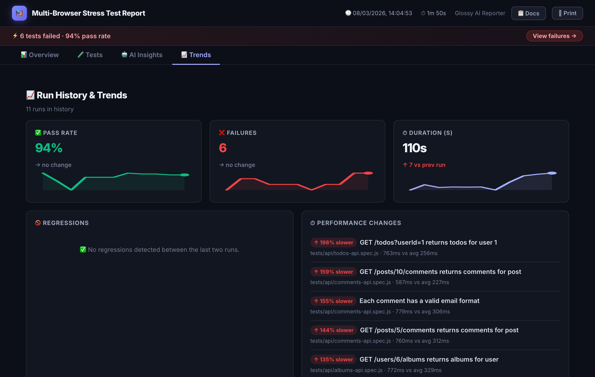
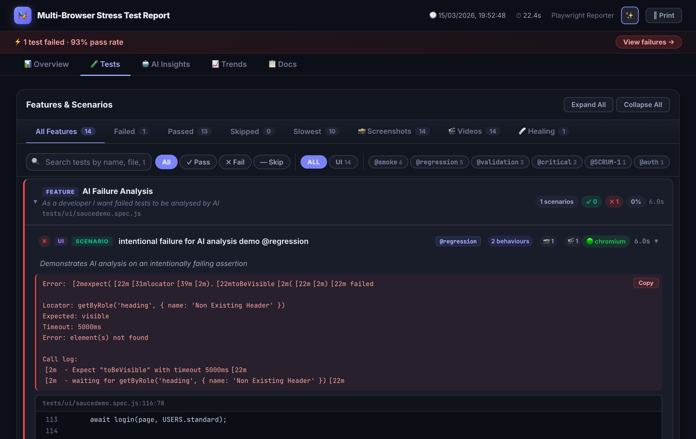
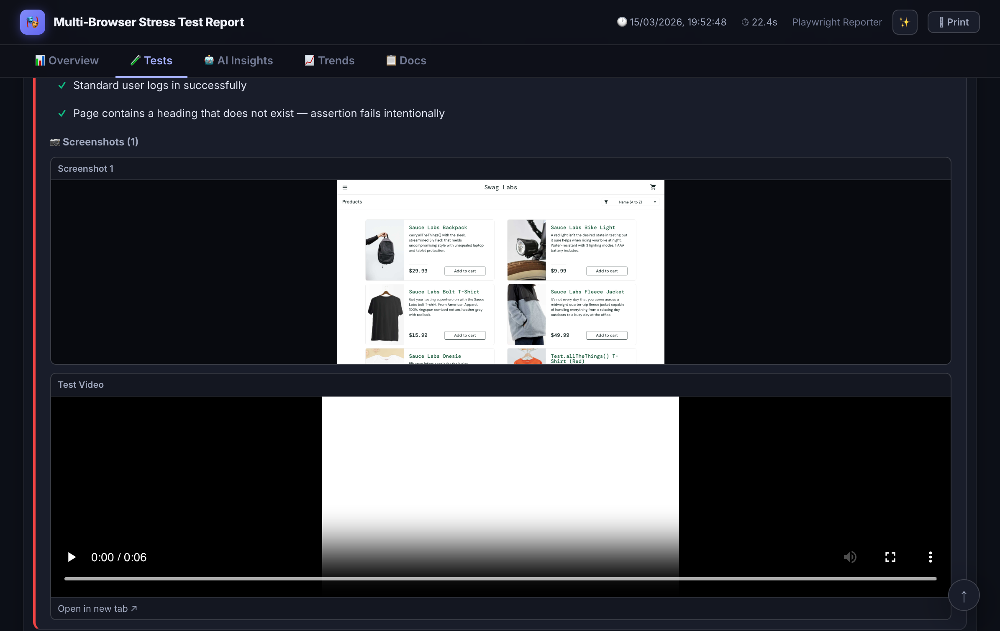
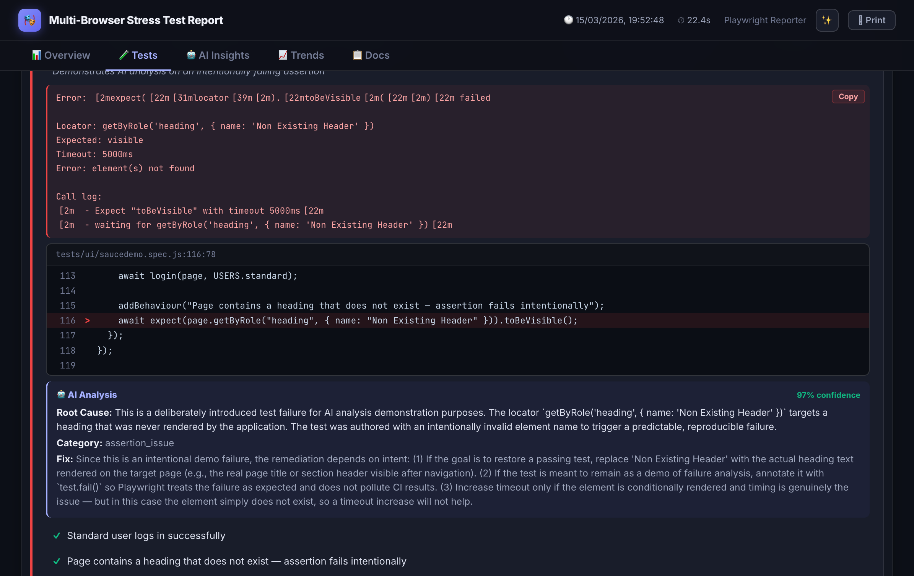
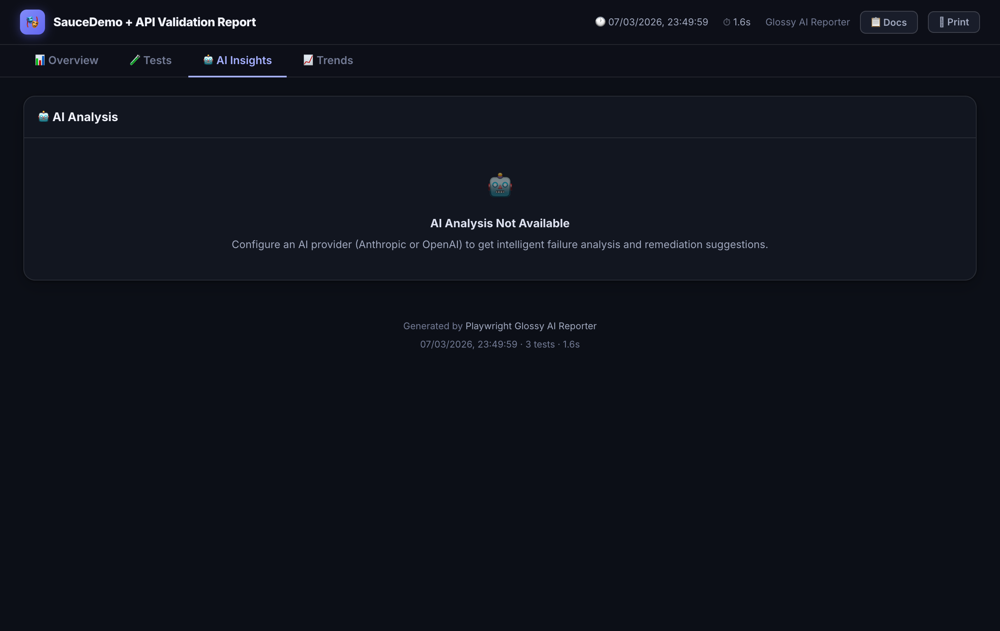
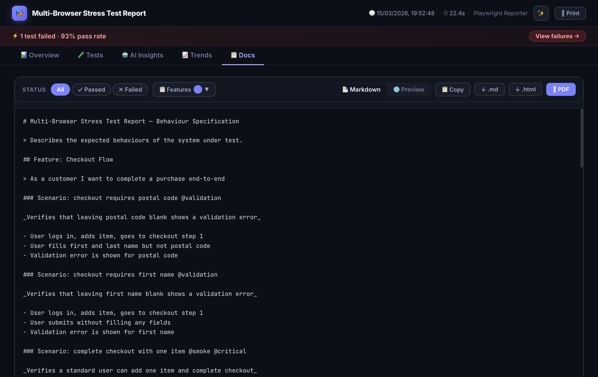
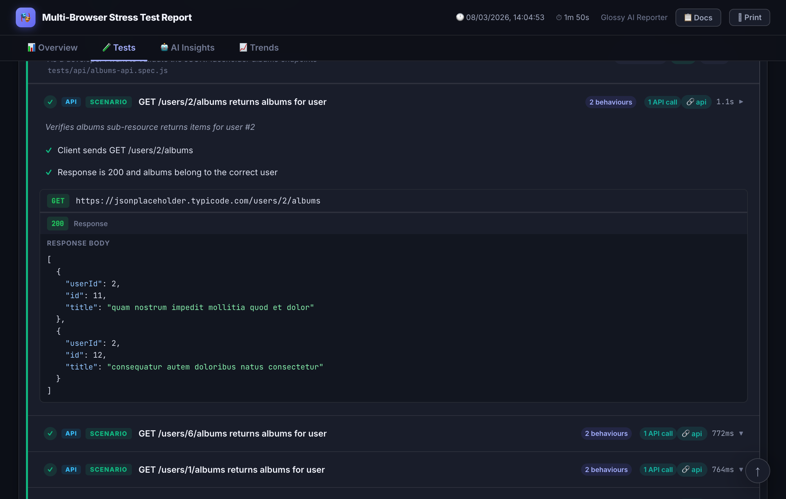
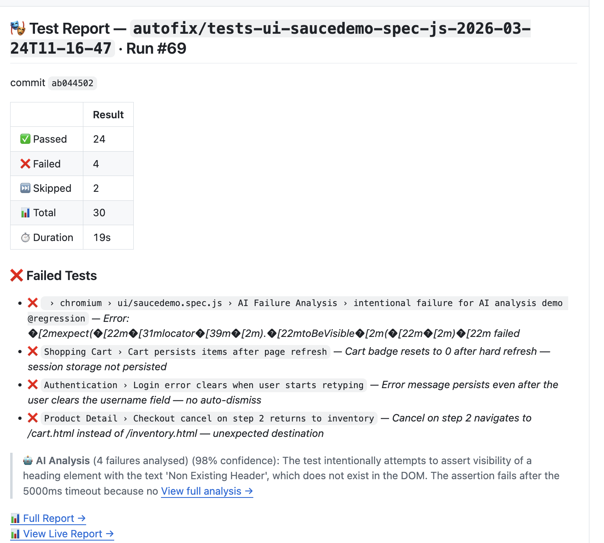

# playwright-spec-doc-reporter

A beautiful, production-ready Playwright reporter with BDD-style annotations, inline API request/response display, AI-powered failure analysis, automatic healing PR generation, Jira auto-bug creation, test history trends, self-healing payload exports, and automatic Jira issue commenting with screenshot and video evidence.

[](https://www.npmjs.com/package/playwright-spec-doc-reporter)
[](https://github.com/pnakhat/playwright-spec-doc-reporter/actions/workflows/ci.yml)
[](LICENSE)

---

## Screenshots

### Dashboard Overview


### Tests Tab — Failure with AI Analysis Expanded


### Test Detail — BDD Annotations, AI Analysis, Screenshots & Video


### BDD Feature / Scenario / Behaviours View


### AI Insights Tab — Root Cause Analysis & Remediations


### Run History & Trends


### Docs Tab — Behaviour Specification Export


### Inline API Request / Response Viewer


---

## Features

- **Interactive HTML dashboard** — dark-themed report with filter, search, sort, and failure drill-down
- **BDD annotations** — add Feature, Scenario, and Behaviour metadata directly in your tests
- **Browser badges** — chromium, firefox, and webkit runs shown with distinct colour-coded pills
- **Inline API viewer** — attach request/response JSON directly to test results with syntax highlighting
- **AI failure analysis** — automatic root-cause analysis for failed tests (OpenAI, Anthropic, Azure, or custom)
- **Spec-to-test traceability** — map Playwright Agent spec files (`specs/*.md`) to generated tests via `// spec:` comments; surfaced on the Traceability tab with live pass/fail status per scenario
- **Healing Layer** — detect Playwright Healer agent outcomes (auto-healed amber badge, app-broken red badge) from `git diff` and test annotations; before→after locator diff panels; `healing.json` export
- **Healing payloads** — structured JSON + Markdown export of suggested locator fixes (AI-driven)
- **PR Comment Mode** — emit a compact markdown summary for posting directly as a GitHub/Azure DevOps PR comment
- **Docs page** — generate filtered Markdown/HTML/PDF behaviour specs from your test suite with live feature filtering
- **History & trends** — pass-rate and duration charts across runs via `spec-doc-history.json`
- **Auto-Healing PR Generation** — when AI analysis identifies fixable locator drift, automatically create a topic branch, apply patches, and open a draft PR on GitHub or Azure DevOps with rich description, test plan checklist, and labels (`auto-fix`, `test-failure`, `ai-generated`)
- **Jira Auto-Bug Creation** — automatically create Jira Bug tickets for failed tests with ADF-formatted descriptions (AI analysis, error, stack trace, BDD steps, API traffic) plus screenshot and video attachments; deduplicates against open bugs
- **Jira integration** — automatically post test results as Jira comments; includes BDD docs, steps, screenshots, API traffic, and videos; `commentOnStatusChange` posts only when a test flips pass↔fail, preventing comment spam
- **Manual test results** — merge manually-authored test results (Gherkin or plain prose) into the report; `@manual` badge and filter; Jira tagging works identically
- **Flakiness scoring** — per-test stability badges computed from run history (0–100%)
- **Theme switcher** — dark-glossy, dark, and light themes with localStorage persistence
- **Zero runtime dependencies** — single self-contained HTML file output

---

## Install

```bash
npm install -D playwright-spec-doc-reporter
```

`@playwright/test >= 1.44.0` is a peer dependency.

---

## Quick start

Because this package is ESM-only, create a thin `reporter.mjs` shim in your project root:

```js
// reporter.mjs
export { GlossyPlaywrightReporter as default } from "playwright-spec-doc-reporter";
```

Then reference it in `playwright.config.ts` / `playwright.config.js`:

```ts
import { defineConfig } from "@playwright/test";

export default defineConfig({
  reporter: [
    ["list"],
    [
      "./reporter.mjs",
      {
        outputDir: "spec-doc-report",
        reportTitle: "E2E Quality Report",
        includeScreenshots: true,
        includeVideos: true,
        includeTraces: true,
      },
    ],
  ],
});
```

Run your tests as normal:

```bash
npx playwright test
```

After each run, `spec-doc-report/` contains:

| File | Description |
|------|-------------|
| `index.html` | Self-contained interactive HTML report |
| `results.json` | Full normalized JSON for CI/CD processing |
| `spec-doc-history.json` | Per-run history for trend charts |
| `healing.json` | AI-suggested locator fixes (when AI enabled) + Healer agent outcomes (when `healing.enabled`) |
| `healing.md` | Human-readable healing summary (when AI enabled) |
| `traceability.json` | Spec↔test bidirectional mapping (when `specs/*.md` files + `// spec:` comments present) |
| `pr-comment.md` | Compact markdown for PR comments (when `prComment` enabled) |

---

## BDD Annotations

Import annotation helpers from the `/annotations` sub-path and call them inside `test()` bodies.

```ts
import { addFeature, addScenario, addBehaviour } from "playwright-spec-doc-reporter/annotations";
```

### `addFeature(name, description?)`

Sets the Feature name and optional Gherkin-style narrative. Call once per `describe` block via `beforeEach`.

```ts
test.describe("Shopping Cart", () => {
  test.beforeEach(() => {
    addFeature(
      "Shopping Cart",
      "As a customer I want to add products to my cart so I can purchase them"
    );
  });

  test("add item to cart", async ({ page }) => { /* ... */ });
});
```

### `addScenario(description)`

Sets a scenario-level description (acceptance criteria) for the current test.

```ts
test("standard user can login and add item to cart", async ({ page }) => {
  addScenario("Verifies the happy-path for a standard user adding one item");
  // ...
});
```

### `addBehaviour(description)`

Adds a human-readable behaviour step. These appear in the BDD view and exported Docs instead of raw Playwright step names.

```ts
test("login flow", async ({ page }) => {
  addBehaviour("User submits valid credentials on the login page");
  await page.goto("/login");
  await page.fill("#email", "user@example.com");
  await page.click("button[type=submit]");

  addBehaviour("User is redirected to the dashboard");
  await expect(page).toHaveURL("/dashboard");
});
```

---

## Inline API Request / Response

Attach request and response data so they appear inline in the report with syntax-highlighted JSON.

```ts
import {
  addFeature, addScenario, addBehaviour,
  addApiRequest, addApiResponse
} from "playwright-spec-doc-reporter/annotations";

test.describe("Posts API", () => {
  test.beforeEach(() => {
    addFeature("Posts API", "As a developer I want to validate the posts endpoints");
  });

  test("POST /posts creates a resource", async ({ request, baseURL }) => {
    addScenario("Verifies a new post is created and returned with an id");

    const payload = { title: "Hello", body: "World", userId: 1 };

    addBehaviour("Client sends POST request with post data");
    addApiRequest("POST", `${baseURL}/posts`, payload);
    const res = await request.post(`${baseURL}/posts`, { data: payload });
    const body = await res.json();
    addApiResponse(res.status(), body);

    addBehaviour("Response is 201 with the new resource including an id");
    expect(res.status()).toBe(201);
    expect(body).toMatchObject(payload);
  });
});
```

The report shows each pair with a colour-coded method badge, URL, collapsible JSON body, and HTTP status badge.

### `addApiRequest(method, url, body?, headers?)`

| Param | Type | Description |
|-------|------|-------------|
| `method` | `string` | HTTP method (`GET`, `POST`, etc.) |
| `url` | `string` | Full request URL |
| `body` | `unknown` | Request body (JSON-serialized in the report) |
| `headers` | `Record<string, string>` | Request headers (shown collapsed) |

### `addApiResponse(status, body?, headers?)`

| Param | Type | Description |
|-------|------|-------------|
| `status` | `number` | HTTP status code |
| `body` | `unknown` | Response body (JSON-serialized in the report) |
| `headers` | `Record<string, string>` | Response headers (shown collapsed) |

---

## Reporter configuration

```ts
type SpecDocReporterConfig = {
  /** Output directory. Default: "spec-doc-report" */
  outputDir?: string;

  /** Report title shown in the dashboard header. */
  reportTitle?: string;

  /** Include screenshots in the report. Default: true */
  includeScreenshots?: boolean;

  /** Include video recordings. Default: true */
  includeVideos?: boolean;

  /** Include Playwright traces. Default: true */
  includeTraces?: boolean;

  /** AI failure analysis configuration. */
  ai?: {
    enabled: boolean;
    provider: "openai" | "anthropic" | "azure" | "azure-claude" | "custom";
    model: string;
    apiKey?: string;
    baseURL?: string;
    maxTokens?: number;
    rateLimitPerMinute?: number;
    maxFailuresToAnalyze?: number;
    customPrompt?: string;
  };

  /** Healing payload export + auto-PR configuration. */
  healing?: {
    enabled: boolean;
    exportPath?: string;
    exportMarkdownPath?: string;
    analysisOnly?: boolean;

    /**
     * Automatically create a topic branch, apply AI patches, and open a
     * draft PR after each run. Requires ai.enabled: true + autofix credentials.
     */
    generatePR?: boolean;

    /** Platform, branch, and credentials for the auto-PR workflow. */
    autofix?: {
      platform?: "github" | "azure";   // default: "github"
      baseBranch?: string;             // default: "main"
      draft?: boolean;                 // default: true
      labels?: string[];               // default: ["auto-fix","test-failure","ai-generated"]
      minConfidence?: number;          // 0–1, default: 0.7
      createBackup?: boolean;          // backup original files, default: true
      githubToken?: string;            // falls back to GITHUB_TOKEN
      githubRepo?: string;             // "owner/repo", falls back to GITHUB_REPOSITORY
      azureOrg?: string;               // https://dev.azure.com/myorg, falls back to AZDO_ORG
      azureProject?: string;           // falls back to AZDO_PROJECT
      azureRepo?: string;              // falls back to AZDO_REPO
      azureToken?: string;             // falls back to AZDO_TOKEN
    };
  };

  /**
   * Spec-to-test traceability (Playwright Agent pipeline).
   * Automatically active when specs/ directory and // spec: comments are present.
   * No configuration required — set healing.enabled: true to also surface the
   * Healer signal (auto-healed / app-broken) on the Traceability tab.
   */
  // traceability is auto-detected, no config key needed

  /** PR comment markdown generation. */
  prComment?: {
    enabled: boolean;
    outputPath?: string;       // default: <outputDir>/pr-comment.md
    artifactUrl?: string;      // falls back to REPORT_ARTIFACT_URL env var
    title?: string;            // branch/label shown in the header
    maxFailures?: number;      // max failed tests to list inline, default 10
  };

  /** Merge manual test results from a Markdown file into the report. */
  manualTests?: {
    resultsPath: string;          // path to your manual-results.md file
  };

  /** Jira issue commenting + auto-bug creation. */
  jira?: {
    enabled: boolean;
    baseUrl: string;              // https://yourorg.atlassian.net
    email?: string;               // falls back to JIRA_EMAIL env var
    apiToken?: string;            // falls back to JIRA_API_TOKEN env var
    commentOnPass?: boolean;         // default: true
    commentOnFail?: boolean;         // default: true
    commentOnSkip?: boolean;         // default: false
    commentOnStatusChange?: boolean; // only comment when pass↔fail flips, default: false
    includeScreenshots?: boolean;    // upload & embed screenshots inline, default: true
    includeApiTraffic?: boolean;     // include API request/response logs, default: true
    commentCooldownMs?: number;      // skip if a comment was posted within this window, default: 0

    /**
     * Automatically create Jira Bug tickets for failed tests.
     * No @PROJECT-123 tag required — bugs are created in the configured project.
     */
    autoBugs?: {
      enabled: boolean;
      projectKey: string;             // e.g. "QA" — falls back to JIRA_PROJECT_KEY env var
      issueType?: string;             // default: "Bug"
      defaultPriority?: string;       // default: "Medium"
      labels?: string[];              // default: ["auto-generated","playwright"]
      onlyForAIAnalyzed?: boolean;    // skip tests without AI analysis, default: true
      deduplicateByTestName?: boolean;// skip if open bug exists, default: true
      includeScreenshots?: boolean;   // attach screenshots, default: true
      includeVideos?: boolean;        // attach video recordings, default: true
      includeApiTraffic?: boolean;    // embed API traffic in description, default: true
    };
  };

  /** Factory for a custom AI provider. */
  providerFactory?: (config: AIProviderConfig) => AIProvider;
};
```

---

## AI failure analysis

When a test fails, the reporter automatically calls your configured AI provider to analyse the error, stack trace, and screenshot. Results appear inline next to each failing test and summarised on the **AI Insights** tab.

### OpenAI

```ts
ai: {
  enabled: true,
  provider: "openai",
  model: "gpt-4.1",              // or "gpt-4o", "gpt-4o-mini"
  apiKey: process.env.OPENAI_API_KEY,
  maxFailuresToAnalyze: 10,
  maxTokens: 1200,
  rateLimitPerMinute: 20,
}
```

### Anthropic

```ts
ai: {
  enabled: true,
  provider: "anthropic",
  model: "claude-sonnet-4-6",    // or "claude-opus-4-6", "claude-haiku-4-5"
  apiKey: process.env.ANTHROPIC_API_KEY,
  maxFailuresToAnalyze: 10,
}
```

### Azure OpenAI (OpenAI-compatible endpoint)

For Claude or other models deployed via **Azure AI Foundry / Azure AI Services** using the OpenAI-compatible chat completions endpoint:

```ts
ai: {
  enabled: true,
  provider: "azure",
  model: "claude-3-7-sonnet",          // your deployment name
  baseURL: process.env.AZURE_ENDPOINT, // https://<resource>.services.ai.azure.com
  apiKey: process.env.AZURE_API_KEY,
  apiVersion: "2024-05-01-preview",    // optional, this is the default
  maxFailuresToAnalyze: 10,
}
```

Authentication uses the `api-key` header (Azure subscription key).

### Azure Claude (native Anthropic Messages API)

For Claude models deployed via **Azure Cognitive Services** that expose the native Anthropic Messages API:

```ts
ai: {
  enabled: true,
  provider: "azure-claude",
  model: process.env.AZURE_CLAUDE_DEPLOYMENT!, // your deployment name
  baseURL: process.env.AZURE_ENDPOINT,         // https://<resource>.cognitiveservices.azure.com
  apiKey: process.env.AZURE_API_KEY,
  maxFailuresToAnalyze: 10,
}
```

The endpoint called is `{baseURL}/anthropic/v1/messages`. Authentication uses the `x-api-key` header — the same format as the standard Anthropic API.

### Custom prompt

```ts
ai: {
  enabled: true,
  provider: "anthropic",
  model: "claude-sonnet-4-6",
  apiKey: process.env.ANTHROPIC_API_KEY,
  customPrompt: `
    You are an expert in Playwright + React testing.
    Prioritise data-testid selectors over CSS classes.
    Always provide a ready-to-paste code patch when the issue is a locator.
  `,
}
```

### Custom provider

```ts
import type { AIProvider, AIProviderConfig } from "playwright-spec-doc-reporter";

const providerFactory = (_cfg: AIProviderConfig): AIProvider => ({
  name: "internal-llm",
  async analyzeFailure(input, cfg) {
    const response = await fetch("https://ai.internal/analyze", {
      method: "POST",
      headers: { Authorization: `Bearer ${cfg.apiKey}` },
      body: JSON.stringify({ error: input.errorMessage, stack: input.stackTrace }),
    });
    const data = await response.json();
    return {
      testName: input.testName,
      file: input.file,
      summary: data.summary,
      likelyRootCause: data.rootCause,
      confidence: data.confidence,
      suggestedRemediation: data.fix,
      issueCategory: data.category ?? "unknown",
      structuredFeedback: {
        actionType: data.actionType ?? "investigate",
        reasoning: data.reasoning,
        suggestedPatch: data.patch,
      },
    };
  },
});
```

Pass the factory to the reporter config:

```ts
// playwright.config.ts
import { providerFactory } from "./my-ai-provider.js";

reporter: [["./reporter.mjs", { ai: { enabled: true }, providerFactory }]]
```

### Store the API key safely

```bash
# .env (gitignored)
ANTHROPIC_API_KEY=sk-ant-...
OPENAI_API_KEY=sk-...
AZURE_API_KEY=...
AZURE_ENDPOINT=https://<resource>.cognitiveservices.azure.com
AZURE_CLAUDE_DEPLOYMENT=claude-haiku45-gdf-np-un-001
```

Load it without dotenv (Node 20.6+):

```bash
node --env-file=.env node_modules/.bin/playwright test
```

Or add to `package.json`:

```json
{ "scripts": { "test": "node --env-file=.env node_modules/.bin/playwright test" } }
```

The `apiKey` config field falls back to provider-specific env vars automatically:

| Provider | Env var fallback |
|---|---|
| `openai` | `OPENAI_API_KEY` |
| `anthropic` | `ANTHROPIC_API_KEY` |
| `azure` | `AZURE_API_KEY` |
| `azure-claude` | `AZURE_CLAUDE_API_KEY`, then `AZURE_API_KEY` |

---

## Healing payloads

When AI analysis identifies locator issues (`issueCategory: "locator_drift"`), structured healing payloads are generated alongside the report.

```ts
healing: {
  enabled: true,
  exportPath: "spec-doc-report/healing.json",
  exportMarkdownPath: "spec-doc-report/healing.md",
  analysisOnly: true,  // never auto-modifies test files
}
```

**Payload schema:**

```ts
interface HealingPayload {
  testName: string;
  file: string;
  stepName?: string;
  failedLocator?: string;
  candidateLocators: string[];  // ranked alternatives
  domContext?: string;          // surrounding HTML snippet
  errorMessage?: string;
  suggestedPatch?: string;      // ready-to-apply code change
  reasoning: string;
  confidence: number;           // 0–1
  actionType: string;
}
```

The `healing.md` export is human-readable and CI-comment-friendly.

---

## Spec-to-Test Traceability

> **Requires Playwright Agent ≥ 1.56** (Planner → Generator → Healer pipeline)
> See [Playwright Agent docs →](https://playwright.dev/docs/test-ai)

When tests are generated from spec files by the Playwright Agent, the reporter can surface a **Traceability** tab that maps each spec scenario to its generated test — and shows whether it passed or failed.

### How it works

1. The Playwright Agent **Planner** writes spec files under `specs/*.md`:

```markdown
# Smoke Tests

## Homepage loads successfully

Verify the application homepage responds and displays the expected content.

## Navigation works end-to-end

Ensure all primary navigation links are reachable and return valid pages.
```

2. The **Generator** creates test files with a `// spec:` header comment pointing back to the source spec:

```ts
// spec: specs/smoke.md
// seed: tests/passing.spec.ts
import { test, expect } from '@playwright/test';

test('Homepage loads successfully', async ({ page }) => {
  await page.goto('https://example.com');
  await expect(page).toHaveTitle(/Example/);
});
```

3. The reporter reads `specs/*.md`, follows the `// spec:` comments in each `.spec.ts` file, and builds a bidirectional traceability index.

### Dashboard output

The **Traceability** tab shows a two-column table:

| Spec / Scenarios | Linked Tests |
|---|---|
| ✦ Smoke Tests<br>• Homepage loads successfully<br>• Navigation works end-to-end | ✓ tests/smoke.spec.ts |

Each linked test row shows a live pass/fail/skip icon sourced from the current run.

### Output files

| File | Description |
|---|---|
| `traceability.json` | Full bidirectional spec↔test mapping |

The `traceability.json` schema:

```json
{
  "specs": [
    {
      "filePath": "specs/smoke.md",
      "title": "Smoke Tests",
      "scenarios": ["Homepage loads successfully", "Navigation works end-to-end"]
    }
  ],
  "mapping": {
    "specs/smoke.md": ["tests/smoke.spec.ts"]
  },
  "reverseMapping": {
    "tests/smoke.spec.ts": "specs/smoke.md"
  }
}
```

### Enabling traceability

No extra config required — the reporter scans for `specs/` automatically. Add the `// spec: <path>` comment to the top of any generated test file to establish the link.

---

## Healing Layer (Playwright Healer Agent)

> **Requires Playwright Agent ≥ 1.56** — see [Playwright Agent docs →](https://playwright.dev/docs/test-ai)

When the Playwright **Healer** agent processes a failing test run it either:

- **Auto-heals** the test by patching the stale locator and re-running — test passes
- **Skips (fix later)** the test when the element is truly gone — marks it for manual review

The reporter detects both outcomes and surfaces them as badges on test cards.

### How healing is detected

The reporter inspects two signals:

| Signal | Outcome |
|---|---|
| `result.annotations` contains `{ type: "healer" }` AND test **passed** | `auto-healed` |
| `git diff HEAD -- tests/` shows a `.spec.ts` change AND test **passed** | `auto-healed` |
| `result.annotations` contains `{ type: "healer" }` AND test **skipped** | `skipped-app-broken` |

### Dashboard badges

| Badge | Colour | Meaning |
|---|---|---|
| **Auto-healed** | Amber | Healer patched the locator; test passed |
| **App broken** | Red | Healer could not fix; test skipped for manual review |

Expanded test cards show a before→after locator diff panel when a git patch was detected.

### Simulating the Healer (demo)

To demonstrate the "fix later" outcome, add the healer annotation and `test.skip()` inside the failing test:

```ts
test('Navigation works end-to-end', async ({ page }) => {
  // Healer agent annotation
  test.info().annotations.push({
    type: 'healer',
    description:
      "page.getByRole('link', { name: 'More information' }) — element not found. " +
      "Skipped for manual review.",
  });
  // Healer puts the test into 'fix later' mode
  test.skip(true, 'Healer: locator not found — skipped until app is fixed');

  await page.goto('https://example.com');
  const link = page.getByRole('link', { name: 'More information' });
  await expect(link).toBeVisible();
});
```

### Config

```ts
healing: {
  enabled: true,
}
```

When `enabled: true`, the reporter:
- Runs `git diff HEAD -- tests/` to detect patched files
- Reads `result.annotations` for healer entries
- Writes `healing.json` with the full healing summary
- Shows the Healer signal (Low / Medium / High) on the Traceability tab

### Output files

| File | Description |
|---|---|
| `healing.json` | Healing summary with per-test outcomes and locator diffs |

### Does auto-healing work in CI/CD?

**Yes** — with two detection signals, both of which work in CI:

| Signal | How it works in CI | Requires |
|---|---|---|
| `result.annotations` `type: "healer"` | Playwright Healer injects this annotation into the test at runtime — no git needed | Playwright Agent/Healer running in pipeline |
| `git diff HEAD -- <testDir>` | Detects patched `.spec.ts` files after Healer mutates them | Git available (standard in all CI environments) + Playwright Healer running |

The annotation signal is the primary one for CI — it fires whenever the real Playwright Healer patches and re-runs a test, regardless of git state.

**GitHub Actions example** (with Playwright Healer configured):

```yaml
- name: Run Playwright tests with Healer
  run: npx playwright test
  env:
    ANTHROPIC_API_KEY: ${{ secrets.ANTHROPIC_API_KEY }}  # needed by Playwright Healer
```

**What the reporter needs from CI:**

```yaml
# No extra setup needed for healing detection.
# The reporter reads annotations and runs `git diff HEAD -- <testDir>`
# (wrapped in try/catch — silently skipped if git is unavailable).
#
# Standard checkout is sufficient:
- uses: actions/checkout@v4  # creates a proper git repo with HEAD
```

**`git diff` works with shallow clones** — `actions/checkout@v4` defaults to `fetch-depth: 1` (shallow), which is fine. `git diff HEAD` compares the working tree against the single commit that was checked out.

**What won't trigger healing detection in CI:**
- Running `playwright test` *without* the Playwright Healer agent (no agent = no annotations or patches)
- A non-git workspace (`git diff` silently returns empty; annotation signal still works)

---

## Auto-Healing PR Generation

> **Requires `ai.enabled: true`** and a GitHub or Azure DevOps personal access token.

When AI analysis identifies fixable test failures, the reporter can automatically:

1. Create a topic branch `autofix/<test-name>-<timestamp>`
2. Apply AI-suggested patches to the failing test files
3. Commit the fixes with a detailed message
4. Push the branch to origin
5. Open a **draft PR** with rich description, diff panels, and a test-plan checklist
6. Apply labels: `auto-fix`, `test-failure`, `ai-generated`

### Quick start

```ts
// playwright.config.ts
healing: {
  enabled: true,
  generatePR: true,            // ← enable auto-PR
  autofix: {
    platform: "github",        // or "azure"
    baseBranch: "main",
    minConfidence: 0.7,        // only apply patches with ≥70% AI confidence
    draft: true,               // always open as draft for mandatory review
  },
}
```

### GitHub setup

```bash
# .env (gitignored)
GITHUB_TOKEN=ghp_...           # Personal Access Token with repo + pull_request scopes
GITHUB_REPOSITORY=owner/repo   # e.g. pnakhat/playwright-spec-doc-reporter
```

```ts
autofix: {
  platform: "github",
  githubToken: process.env.GITHUB_TOKEN,     // or just use env vars
  githubRepo: process.env.GITHUB_REPOSITORY, // "owner/repo"
  baseBranch: "main",
  draft: true,
  labels: ["auto-fix", "test-failure", "ai-generated"],
}
```

**GitHub Actions** — use the built-in `GITHUB_TOKEN`:

```yaml
jobs:
  test:
    runs-on: ubuntu-latest
    permissions:
      contents: write       # push branch
      pull-requests: write  # create PR
    steps:
      - uses: actions/checkout@v4
        with:
          fetch-depth: 0    # needed for git diff

      - name: Run Playwright tests
        run: npx playwright test
        env:
          ANTHROPIC_API_KEY: ${{ secrets.ANTHROPIC_API_KEY }}
          GITHUB_TOKEN: ${{ secrets.GITHUB_TOKEN }}
          GITHUB_REPOSITORY: ${{ github.repository }}
```

> The `GITHUB_TOKEN` provided by Actions has `contents: write` and `pull-requests: write` when those permissions are granted in the job.

### Azure DevOps setup

```bash
# .env (gitignored)
AZDO_ORG=https://dev.azure.com/myorg
AZDO_PROJECT=MyProject
AZDO_REPO=my-repo
AZDO_TOKEN=...   # Personal Access Token with Code (Read & Write) + Pull Request (Read & Write)
```

```ts
autofix: {
  platform: "azure",
  azureOrg: process.env.AZDO_ORG,
  azureProject: process.env.AZDO_PROJECT,
  azureRepo: process.env.AZDO_REPO,
  azureToken: process.env.AZDO_TOKEN,
  baseBranch: "main",
  draft: true,
}
```

**Azure Pipelines** — use the system access token:

```yaml
variables:
  AZDO_ORG: https://dev.azure.com/$(System.TeamFoundationCollectionUri)
  AZDO_PROJECT: $(System.TeamProject)
  AZDO_REPO: $(Build.Repository.Name)

steps:
  - checkout: self
    fetchDepth: 0

  - script: npx playwright test
    displayName: Run Playwright tests
    env:
      ANTHROPIC_API_KEY: $(ANTHROPIC_API_KEY)
      AZDO_TOKEN: $(System.AccessToken)
      AZDO_ORG: $(AZDO_ORG)
      AZDO_PROJECT: $(AZDO_PROJECT)
      AZDO_REPO: $(AZDO_REPO)
```

> Grant the pipeline **Contribute** and **Create pull requests** permissions on the repository under _Project Settings → Repositories → Security_.

### What the draft PR looks like

```
fix(autofix): heal 2 failing test(s) — intentional failure for AI analysis demo

Branch: autofix/tests-ui-saucedemo-spec-js-2026-03-24T11-16-47
Commit: 42b6cbf

## 📁 Patched files (2)

- `tests/ui/saucedemo.spec.js` — intentional failure for AI analysis demo
  - 🎯 Confidence: 97% | Category: assertion_issue
  - ❌ Failed locator: `getByRole('heading', { name: 'Products' })`
  - ✅ Candidate locators: `getByRole('heading', { name: 'Products' })`, ...
  - 💡 Fix the assertion to match the actual page heading

  <details><summary>View patch</summary>
  ...diff...
  </details>

## 🤖 AI Analysis

Root cause: The assertion checks for a heading that does not exist by design.
Category: assertion_issue | Confidence: 97%
Remediation: Replace 'Non Existing Header' with 'Products'

## ✅ Test plan
- [ ] Review each patched locator manually
- [ ] Run `npx playwright test`
- [ ] Approve and merge once green
```

### CLI usage

Run the healing agent manually against an existing `healing.md`:

```bash
# Apply Claude fixes + open a draft PR in one command
npx tsx node_modules/playwright-spec-doc-reporter/src/healing/healingAgent.ts \
  spec-doc-report/healing.md \
  --backup \
  --create-pr \
  --base main

# Environment variables required:
# ANTHROPIC_API_KEY — for Claude to apply fixes
# GITHUB_TOKEN      — to create the PR
# GITHUB_REPOSITORY — "owner/repo"
```

### Configuration reference

| Option | Type | Default | Description |
|---|---|---|---|
| `platform` | `"github" \| "azure"` | `"github"` | Target VCS platform |
| `baseBranch` | `string` | `"main"` | PR target branch |
| `draft` | `boolean` | `true` | Open PR as draft |
| `labels` | `string[]` | `["auto-fix","test-failure","ai-generated"]` | PR labels |
| `minConfidence` | `number` | `0.7` | Minimum AI confidence to apply a patch |
| `createBackup` | `boolean` | `true` | Save `.backup` of original files |
| `githubToken` | `string` | `GITHUB_TOKEN` | GitHub PAT |
| `githubRepo` | `string` | `GITHUB_REPOSITORY` | `"owner/repo"` |
| `azureOrg` | `string` | `AZDO_ORG` | Azure DevOps org URL |
| `azureProject` | `string` | `AZDO_PROJECT` | Azure DevOps project |
| `azureRepo` | `string` | `AZDO_REPO` | Repository name |
| `azureToken` | `string` | `AZDO_TOKEN` | Azure DevOps PAT |

---

## PR Comment Mode

Instead of downloading a report artifact, engineers reviewing a PR get test results inline — right where they're already looking.

Enable it in `playwright.config`:

```ts
prComment: {
  enabled: true,
  artifactUrl: process.env.REPORT_ARTIFACT_URL,  // link to the uploaded HTML report
  maxFailures: 10,
}
```

This writes `spec-doc-report/pr-comment.md` after each run and posts it directly into the pull request — engineers see test results without leaving GitHub or Azure DevOps:



The comment includes:
- Pass / fail / skip counts and total duration
- Every failed test with its error message
- AI analysis summary with confidence score
- Direct links to the full HTML report and live report

### Posting the comment on GitHub

```yaml
- name: Upload report
  if: always()
  uses: actions/upload-artifact@v4
  with:
    name: test-report
    path: spec-doc-report/

- name: Post PR comment
  if: always() && github.event_name == 'pull_request'
  uses: marocchino/sticky-pull-request-comment@v2
  with:
    path: spec-doc-report/pr-comment.md
```

Set `REPORT_ARTIFACT_URL` to point reviewers at the full report:

```yaml
- name: Run tests
  run: npx playwright test
  env:
    REPORT_ARTIFACT_URL: https://github.com/${{ github.repository }}/actions/runs/${{ github.run_id }}
```

### Posting on Azure DevOps

```yaml
- task: PowerShell@2
  displayName: Post PR comment
  condition: always()
  inputs:
    targetType: inline
    script: |
      $comment = Get-Content spec-doc-report/pr-comment.md -Raw
      $body = @{ content = $comment; parentCommentId = 0; commentType = 1 } | ConvertTo-Json
      $url = "$env:SYSTEM_TEAMFOUNDATIONCOLLECTIONURI$env:SYSTEM_TEAMPROJECTID/_apis/git/repositories/$(Build.Repository.ID)/pullRequests/$(System.PullRequest.PullRequestId)/threads?api-version=7.1"
      Invoke-RestMethod -Uri $url -Method Post -Headers @{ Authorization = "Bearer $env:SYSTEM_ACCESSTOKEN" } -Body $body -ContentType "application/json"
  env:
    SYSTEM_ACCESSTOKEN: $(System.AccessToken)
```

### Branch and run detection

Branch name, commit SHA, and run number are automatically detected from CI environment variables (`GITHUB_REF_NAME`, `GITHUB_SHA`, `GITHUB_RUN_NUMBER`, and Azure DevOps equivalents). No manual configuration needed in most setups.

---

## Manual Test Results

Merge manually-authored test results into the same HTML report alongside your automated Playwright tests. Manual tests support both plain prose and Gherkin (Given/When/Then) formats, can carry Jira issue tags, and appear with a purple **✎ Manual** badge and a dedicated `@manual` tag filter.

### Setup

Point the reporter at your manual results file:

```js
// playwright.config.js
["./reporter.mjs", {
  outputDir: "spec-doc-report",
  manualTests: {
    resultsPath: "tests/manual-results.md",
  },
}]
```

### File format

Create a Markdown file. `#` headings group tests into Features; `##` headings define individual tests. Tags in the heading line control status and carry through to Jira.

```markdown
# Feature: Checkout Flow

## User can complete checkout with valid card @PASS @SCRUM-10 @smoke
Notes: Tested on Chrome 120, prod environment

## Guest checkout fails with expired card @FAIL @SCRUM-11
Notes: Reproduced 3/3 times
Error: Payment gateway timeout after 30s
```

#### Gherkin style (Given/When/Then)

Any block containing `Given`, `When`, `Then`, `And`, or `But` lines is parsed as Gherkin. Steps are rendered in the test detail view exactly like automated test steps.

```markdown
# Feature: Login

## Scenario: Standard user can login @PASS @SCRUM-1 @smoke
Given I am on the login page
When I enter valid credentials
Then I should be redirected to the dashboard
And I should see my username in the header

## Scenario: Login with expired password @FAIL @SCRUM-2
Given I am on the login page
When I enter credentials for an expired account
Then I should see a password expiry warning
Error: Warning message not displayed — bug confirmed
Notes: Tested on Chrome and Firefox
```

Both formats can coexist in the same file.

### Status tags

| Tag | Result status |
|---|---|
| `@PASS` | passed |
| `@FAIL` | failed |
| `@SKIP` | skipped |
| _(none)_ | passed (default) |

Status tags are stripped from the displayed title. All other tags (e.g. `@smoke`, `@SCRUM-1`) are preserved and appear as filter pills.

### Behaviour in the report

- Manual tests appear in the Tests tab with a purple **✎ Manual** badge
- `@manual` is auto-added to every parsed test — click it in the tag filter bar to isolate manual results
- Failed manual tests count in the overall pass rate and failure banner
- Gherkin steps render in the test detail step timeline
- `Error:` lines appear as the failure message; for Gherkin tests the last step is marked failed
- `Notes:` lines appear as the scenario description

### Jira integration

Manual tests participate in the existing Jira integration without any extra config. A manual test tagged `@SCRUM-1` will post a Jira comment in the same way as an automated test — including BDD docs, steps (Gherkin or notes), and the error message if failed.

---

## Jira Test Results Integration

After each Playwright run, the reporter automatically posts a comment to any Jira issue that a test is tagged with. Tag a test with `@PROJECT-123` (e.g. `@SCRUM-1`) and a formatted comment is posted to that issue containing the test result, steps, BDD documentation, API traffic, and screenshots.

### Setup

Store credentials in environment variables — never hard-code them:

```bash
JIRA_EMAIL=you@yourorg.com
JIRA_API_TOKEN=<your-api-token>   # https://id.atlassian.com/manage-profile/security/api-tokens
```

Enable in `playwright.config.ts`:

```ts
jira: {
  enabled: !!process.env.JIRA_API_TOKEN,
  baseUrl: "https://yourorg.atlassian.net",
  email: process.env.JIRA_EMAIL,
  apiToken: process.env.JIRA_API_TOKEN,

  // What to include in the comment:
  includeScreenshots: true,   // upload & embed Playwright screenshots inline
  includeApiTraffic: true,    // include glossy:request/response API logs

  // Only comment when a test flips pass↔fail (recommended for CI):
  commentOnStatusChange: true,  // default: false

  // OR: time-based cooldown (blunter — may suppress a new failure within the window):
  // commentCooldownMs: 3_600_000,

  // Control which statuses trigger a comment:
  commentOnPass: true,    // default: true
  commentOnFail: true,    // default: true
  commentOnSkip: false,   // default: false
}
```

### Tagging tests

Add the Jira issue key as a tag — the pattern `@PROJECT-123` is automatically detected:

```ts
test("user can checkout @SCRUM-1 @smoke", async ({ page }) => { ... });

// or via test.tag() (Playwright 1.42+):
test("user can checkout", { tag: ["@SCRUM-1", "@smoke"] }, async ({ page }) => { ... });
```

A test can reference multiple issues — each gets its own comment.

### What appears in the comment

| Section | When shown |
|---|---|
| Status, duration, file path | Always |
| 🏷 Feature / 📖 Scenario / ✦ Behaviours | When BDD annotations are present |
| Steps | Always (up to 10) |
| Error + stack snippet | Failed / timed-out tests |
| API Traffic | When `includeApiTraffic: true` and `glossy:request/response` annotations exist |
| 📸 Screenshots | When `includeScreenshots: true` and Playwright captured screenshots |

### Controlling comment frequency

**Recommended: `commentOnStatusChange`**

Set `commentOnStatusChange: true` to only post a comment when a test's result flips since the previous run (pass→fail or fail→pass). Tests that stay at the same status across runs are silently skipped.

```ts
jira: {
  enabled: true,
  commentOnStatusChange: true,  // comment only when pass↔fail flips
}
```

This reads `spec-doc-history.json` (already maintained by the reporter for trend charts). On the first run there is no history, so all tagged tests comment as normal.

**Alternative: `commentCooldownMs`**

A time-based fallback — skips if a comment was posted on the same issue within the configured window. Less precise than `commentOnStatusChange` because it may suppress a genuine new failure that occurs within the cooldown period.

```ts
jira: {
  enabled: true,
  commentCooldownMs: 3_600_000,  // 1 hour
}
```

### Environment variable reference

| Variable | Purpose |
|---|---|
| `JIRA_EMAIL` | Jira account email (Basic auth) |
| `JIRA_API_TOKEN` | Jira API token |
| `JIRA_BASE_URL` | Optional — overrides `baseUrl` in config |

---

## Jira Auto-Bug Creation

> Complements the [Jira Test Results Integration](#jira-test-results-integration) — that feature comments on **user stories** you explicitly tag. This feature creates **Bug tickets** automatically for every failed test, with no tagging required.

### How it works

After each run the reporter:

1. Finds all failed / timed-out tests
2. Optionally checks for an existing open bug with the same test name (deduplication)
3. Creates a `Bug` issue with a full ADF description containing:
   - Test name, file, duration, browser, retries
   - Error message + stack trace
   - AI analysis (root cause, confidence, remediation, suggested patch)
   - BDD steps (Given/When/Then behaviours)
   - API request/response traffic
4. Uploads Playwright **screenshots** and **video recordings** as attachments

### Setup

```bash
# .env (gitignored)
JIRA_BASE_URL=https://yourorg.atlassian.net
JIRA_EMAIL=you@example.com
JIRA_API_TOKEN=ATATT3x...      # https://id.atlassian.com/manage-profile/security/api-tokens
JIRA_PROJECT_KEY=QA            # project where bugs will be created
```

```ts
// playwright.config.ts
jira: {
  enabled: !!process.env.JIRA_API_TOKEN,
  baseUrl: process.env.JIRA_BASE_URL ?? "https://yourorg.atlassian.net",
  email: process.env.JIRA_EMAIL,
  apiToken: process.env.JIRA_API_TOKEN,

  autoBugs: {
    enabled: !!process.env.JIRA_API_TOKEN,
    projectKey: process.env.JIRA_PROJECT_KEY ?? "QA",
    issueType: "Bug",
    defaultPriority: "Medium",
    labels: ["auto-generated", "playwright"],
    onlyForAIAnalyzed: false,           // create bugs for ALL failed tests
    deduplicateByTestName: true,        // skip if open bug already exists
    includeScreenshots: true,           // attach screenshots
    includeVideos: true,                // attach video recordings (.webm)
    includeApiTraffic: true,            // embed API logs in description
  },
}
```

### What the Jira bug looks like

```
Summary: [Playwright] intentional failure for AI analysis demo @regression

Description:
─────────────────────────────────────────────────────
🐛 Failing Test
  Test:     AI Failure Analysis › intentional failure for AI analysis demo
  File:     tests/ui/saucedemo.spec.js
  Status:   failed
  Duration: 7.1s
  Browser:  chromium

❌ Error
  Error: expect(locator).toBeVisible() failed
  Locator: getByRole('heading', { name: 'Non Existing Header' })
  Expected: visible — element(s) not found

🤖 AI Analysis
  Summary:   The assertion checks for a heading that does not exist.
  Root cause: Sentinel heading name used for demo — element absent by design.
  Category:  assertion_issue | Confidence: 97%
  Action:    fix_assertion
  Remediation: Replace 'Non Existing Header' with the actual heading 'Products'.

  Suggested Patch:
    - await expect(page.getByRole('heading', { name: 'Non Existing Header' })).toBeVisible();
    + await expect(page.getByRole('heading', { name: 'Products' })).toBeVisible();

📋 Test Steps
  • Standard user logs in successfully
  • Page contains a heading that does not exist — assertion fails intentionally

🌐 API Traffic
  → GET https://www.saucedemo.com/
  ← 200 https://www.saucedemo.com/
─────────────────────────────────────────────────────
Attachments: test-finished-1.png, video.webm
Labels: auto-generated, playwright
Priority: Medium
```

### Deduplication

When `deduplicateByTestName: true` (default), the reporter runs a Jira JQL search before creating a bug:

```
project = "QA" AND issuetype = Bug AND status != Done
  AND summary ~ "<test name>"
```

If an open bug is found, creation is skipped and the existing issue key is logged:

```
[glossy-reporter] Jira bug skipped (duplicate) → QA-42 for: my failing test
```

### GitHub Actions example

```yaml
- name: Run tests
  run: npx playwright test
  env:
    ANTHROPIC_API_KEY: ${{ secrets.ANTHROPIC_API_KEY }}
    JIRA_BASE_URL: ${{ secrets.JIRA_BASE_URL }}
    JIRA_EMAIL: ${{ secrets.JIRA_EMAIL }}
    JIRA_API_TOKEN: ${{ secrets.JIRA_API_TOKEN }}
    JIRA_PROJECT_KEY: QA
```

### Azure Pipelines example

```yaml
- script: npx playwright test
  displayName: Run Playwright tests
  env:
    ANTHROPIC_API_KEY: $(ANTHROPIC_API_KEY)
    JIRA_BASE_URL: $(JIRA_BASE_URL)
    JIRA_EMAIL: $(JIRA_EMAIL)
    JIRA_API_TOKEN: $(JIRA_API_TOKEN)
    JIRA_PROJECT_KEY: QA
```

Store all secrets under _Pipelines → Library → Variable groups_ and link the group to the pipeline.

### Configuration reference

| Option | Type | Default | Description |
|---|---|---|---|
| `enabled` | `boolean` | — | Enable auto-bug creation |
| `projectKey` | `string` | `JIRA_PROJECT_KEY` | Jira project key, e.g. `"QA"` |
| `issueType` | `string` | `"Bug"` | Jira issue type |
| `defaultPriority` | `string` | `"Medium"` | Issue priority |
| `labels` | `string[]` | `["auto-generated","playwright"]` | Labels applied to the bug |
| `onlyForAIAnalyzed` | `boolean` | `true` | Skip tests without AI analysis |
| `deduplicateByTestName` | `boolean` | `true` | Skip if open bug exists |
| `includeScreenshots` | `boolean` | `true` | Upload screenshots as attachments |
| `includeVideos` | `boolean` | `true` | Upload video recordings as attachments |
| `includeApiTraffic` | `boolean` | `true` | Embed API request/response in description |

### Environment variable reference

| Variable | Purpose |
|---|---|
| `JIRA_BASE_URL` | Jira instance URL, e.g. `https://yourorg.atlassian.net` |
| `JIRA_EMAIL` | Atlassian account email (Basic auth) |
| `JIRA_API_TOKEN` | Jira API token |
| `JIRA_PROJECT_KEY` | Project key for auto-bug creation |

---

## History & Trends

Every run, the reporter automatically:

1. Reads `spec-doc-history.json` from the output directory (starts fresh if none exists)
2. Computes per-test **flakiness scores** from prior history
3. Appends a `RunSnapshot` — pass rate, per-test statuses, branch name, commit SHA
4. Saves the updated history file
5. Embeds the full history into `index.html` for the **Trends** tab

History is capped at **30 runs** (oldest entries dropped automatically).

The Trends tab shows:
- Pass rate / failure count / duration charts over time
- Regressions (tests that newly failed vs previous run)
- Performance changes (tests that got significantly slower or faster)
- Full run history table with branch and commit info

### Persisting history in CI/CD

By default each CI run gets a clean workspace, so `spec-doc-history.json` is lost between runs and trends won't accumulate. Choose one of the following strategies to persist it.

#### Option 1 — GitHub Actions cache (recommended)

```yaml
jobs:
  test:
    runs-on: ubuntu-latest
    steps:
      - uses: actions/checkout@v4

      - name: Restore test history
        uses: actions/cache@v4
        with:
          path: spec-doc-report/spec-doc-history.json
          key: test-history-${{ github.ref }}-${{ github.run_id }}
          restore-keys: |
            test-history-${{ github.ref }}-
            test-history-

      - name: Install dependencies
        run: npm ci

      - name: Run tests
        run: npx playwright test

      - name: Upload report artifact
        if: always()
        uses: actions/upload-artifact@v4
        with:
          name: test-report
          path: spec-doc-report/
```

The `restore-keys` fallback means a new branch inherits the most recent history from any branch, so trends start immediately rather than from scratch.

#### Option 2 — Commit history file to git

```yaml
      - name: Run tests
        run: npx playwright test

      - name: Commit updated history
        run: |
          git config user.email "ci@example.com"
          git config user.name "CI Bot"
          git add spec-doc-report/spec-doc-history.json
          git commit -m "chore: update test history [skip ci]" || exit 0
          git push
```

Use `[skip ci]` in the commit message to prevent a recursive pipeline trigger.

#### Option 3 — Upload/download as artifact

```yaml
      - name: Download previous history
        uses: actions/download-artifact@v4
        with:
          name: test-history
          path: spec-doc-report/
        continue-on-error: true   # first run won't have it yet

      - name: Run tests
        run: npx playwright test

      - name: Upload updated history
        if: always()
        uses: actions/upload-artifact@v4
        with:
          name: test-history
          path: spec-doc-report/spec-doc-history.json
          retention-days: 90
          overwrite: true
```

---

### Persisting history in Azure Pipelines

The same three strategies apply in Azure Pipelines using its equivalent primitives.

#### Option 1 — Pipeline cache (recommended)

```yaml
variables:
  HISTORY_KEY: test-history-$(Build.SourceBranchName)

steps:
  - task: Cache@2
    displayName: Restore test history
    inputs:
      key: '"spec-doc-history" | "$(Build.SourceBranchName)" | "$(Build.BuildId)"'
      restoreKeys: |
        "spec-doc-history" | "$(Build.SourceBranchName)"
        "spec-doc-history"
      path: spec-doc-report/spec-doc-history.json
      cacheHitVar: HISTORY_CACHE_HIT

  - script: npx playwright test
    displayName: Run tests

  - task: PublishPipelineArtifact@1
    condition: always()
    displayName: Upload report
    inputs:
      targetPath: spec-doc-report
      artifact: test-report
```

The `restoreKeys` fallback ensures a new branch inherits the closest available history.

#### Option 2 — Commit history file to git

```yaml
  - script: npx playwright test
    displayName: Run tests

  - script: |
      git config user.email "ci@example.com"
      git config user.name "CI Bot"
      git add spec-doc-report/spec-doc-history.json
      git diff --cached --quiet || git commit -m "chore: update test history ***NO_CI***"
      git push origin HEAD:$(Build.SourceBranchName)
    displayName: Commit updated history
```

Use `***NO_CI***` (or `[skip ci]`) in the commit message to prevent a recursive pipeline trigger.

#### Option 3 — Upload/download as artifact

```yaml
  - task: DownloadPipelineArtifact@2
    displayName: Download previous history
    condition: always()
    continueOnError: true   # first run won't have it yet
    inputs:
      artifact: test-history
      targetPath: spec-doc-report

  - script: npx playwright test
    displayName: Run tests

  - task: PublishPipelineArtifact@1
    condition: always()
    displayName: Upload updated history
    inputs:
      targetPath: spec-doc-report/spec-doc-history.json
      artifact: test-history
```

> **Note:** Azure Pipelines artifacts are immutable per run — you cannot overwrite a published artifact in the same pipeline run. Use the Cache task (Option 1) if you need the history to persist across runs on the same branch without manual cleanup.

---

## Flakiness Scoring

The reporter computes a **flakiness score (0–100%)** per test from the last 10 runs in history:

- Score = (number of pass↔fail transitions) / (runs − 1) × 100
- Skipped runs are excluded from the calculation
- Scores appear as inline badges on test rows: `⚡ 67%`
- Colour coded: **low** (1–29%), **medium** (30–69%), **high** (≥70%)
- A summary card on the Overview page lists the most flaky tests

Flakiness requires at least **2 prior runs** in history. No history = no badges.

---

## Docs Page

The **Docs** tab generates a filtered behaviour specification from your annotated tests.

- **Status filter** — show All / Passed / Failed scenarios only
- **Features dropdown** — multi-select individual features; deselecting all shows an empty doc
- Filters apply immediately with no Generate button
- Export as **Markdown**, rendered **HTML**, or **PDF**
- Copy to clipboard with one click

### Theme

The report supports three themes toggled via the button in the top-right corner:

| Theme | Description |
|-------|-------------|
| `dark-glossy` | Default — dark background with glossy glass-morphism accents |
| `dark` | Standard dark mode, no blur effects |
| `light` | Light background for print or stakeholder sharing |

The selected theme is persisted in `localStorage`. Set a default via config:

```ts
// playwright.config.ts
["./reporter.mjs", { theme: "light" }]
```

---

## Requirements

- Node.js >= 18
- `@playwright/test` >= 1.44.0 (peer dependency)

---

## License

[MIT](LICENSE)
